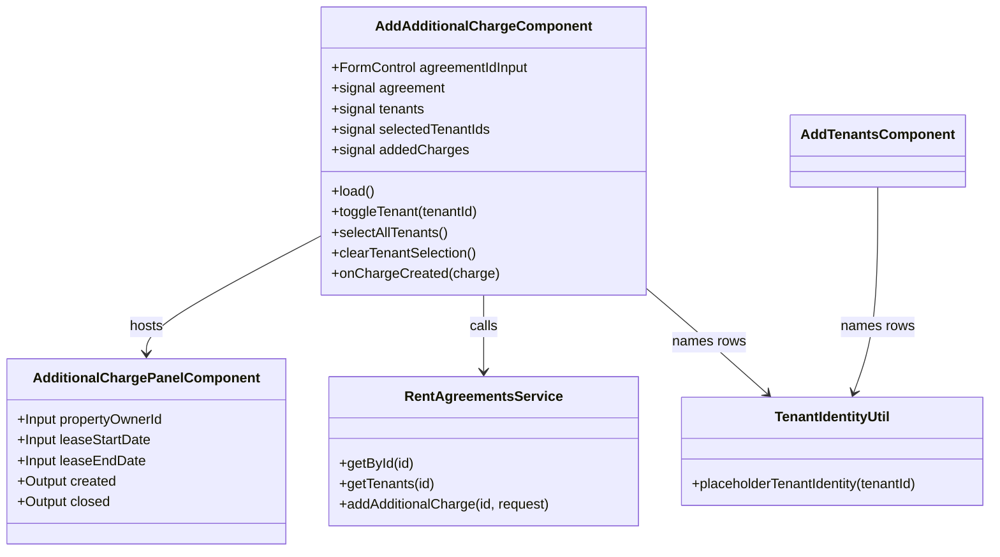

## Changelog

| Version | Date | Summary | Plan |
|---------|------|---------|------|
| v1 | 2026-08-31 | **Initial spec: a standalone "Add Additional Fee" page.** Paste a rent agreement id, the page loads the lease (`GET /rent/agreements/{id}`) and its saved tenants (`GET /rent/agreements/{id}/tenants`), the user ticks which tenants the fee is charged to, builds the fee in the **existing** `AdditionalChargePanelComponent` — reused unchanged, no fork — and the page posts it to `POST /rent/agreements/{id}/additional-charges` with the ticked ids as `tenantIds`. Nothing on the lease-edit page changes: that page still batches its charges into `PUT …/terms`, which remains the only path that can edit or remove one. | [2026-08-31T1200-02-add-additional-charge-ui](../../plans/rent-agreements/2026-08-31T1200-02-add-additional-charge-ui.md) |

## Overview

`AddAdditionalChargeComponent` (`src/app/rent-agreements/add-additional-charge.component.ts`) is the
Angular page behind `/rent-agreements/additional-charges`. It appends **one** additional fee to an
**already saved** lease, charged to a chosen subset of that lease's tenants, through the backend's
`POST /rent/agreements/{id}/additional-charges` endpoint (backend spec `01-rent-agreement.md`
FR-054 – FR-062).

It is deliberately a *second* entry point for additional fees, not a replacement for the one on the
lease screen. The lease screen (spec `01-rent-agreement-edit-ui.md`) collects charges into the
lease's own create/edit body and can edit or delete them; this page can only **add**, but it is the
only place that can add one to a lease that is already saved — and the only place that can say *who
pays it*.

The fee itself is built by the existing `AdditionalChargePanelComponent`, imported and used as-is.
This spec adds no new fee-authoring UI; it adds the lease lookup, the tenant picker, and the wiring
to a different endpoint.

## Business Scope

A property manager needs to bill something that was not known when the lease was written — a
utility recharge, a repair cost, a pet fee — after the lease is saved and possibly after it is
active. Two facts drive the screen:

1. **The fee often belongs to some tenants, not all of them.** A lease with four renters may bill a
   parking fee to exactly one. The backend has modelled this since FR-058 (`tenantIds`), but no
   screen has ever sent it, so every fee raised from this UI has been shared by everyone.
2. **The lease is already saved**, so the fee cannot ride the create body. It needs the append
   endpoint, which commits the charge — and, when the charge stands alone on an active lease, the
   invoice it raises — in one transaction.

Success: a manager pastes a lease id, sees that lease's tenants, ticks the ones who owe the fee,
fills in the same fee panel they already know from the lease screen, and gets back the persisted
charge with its real id.

## Functional Requirements

1. The system shall present a rent agreement id input and shall refuse to load anything until the
   entered text is a well-formed GUID, reporting the malformed id inline rather than calling the API.
2. On load, the system shall fetch the lease (`GET /rent/agreements/{id}`) and its saved tenants
   (`GET /rent/agreements/{id}/tenants`) concurrently, and shall render nothing of the fee UI until
   both answer.
3. The system shall render every **active** tenant the tenants endpoint returns, each with its
   `tenantId`, its recorded rent share and its recorded deposit share, and a stable stand-in name
   derived from the id — the same derivation the ADD TENANTS screen uses, so the same tenant reads
   as the same person on both screens.
4. The system shall let the user select **any number** of those tenants, including none and all,
   with per-row checkboxes plus "Select all" and "Clear" actions.
5. The system shall treat an empty selection as *"every active tenant shares this fee"* — sending
   `tenantIds: []`, which is the backend's own meaning for the empty list (FR-058) — and shall say so
   on screen, so an empty selection is never mistaken for an unfinished one.
6. When the tenants endpoint answers `204 No Content` (the lease exists but step 2 was never saved),
   the system shall say so, offer a link to that lease's ADD TENANTS screen, and still allow a
   shared fee to be added; it shall not present a tenant picker with nothing in it.
7. The system shall open the existing `AdditionalChargePanelComponent` for fee authoring, passing
   the loaded lease's `propertyOwnerId`, `startDate` and `endDate` so the panel's catalog fetch and
   its candidate-date selects work exactly as they do on the lease screen.
8. On the panel's `created` event the system shall `POST /rent/agreements/{id}/additional-charges`
   **once**, with the panel's charge fields at the body root plus the selected `tenantIds`, and shall
   close the panel only after the request succeeds — a failed submission keeps the authored fee on
   screen instead of discarding it.
9. The system shall render each successfully added charge in a running list on the page — its server
   id, its category, its items and total, its recurrence, and who it was charged to — so a manager
   adding several fees in a row can see what has already been committed.
10. The system shall render a failed submission's RFC 9457 `detail` verbatim when the response body
    carries one, falling back to the status line, and shall keep the lease and its tenants loaded so
    the user can correct and retry without re-entering the id.
11. The system shall not send `isManualInvoice`: the backend accepts and ignores it (every invoice
    this route raises is `Manual` regardless), so sending it would assert a decision the client does
    not make.
12. The system shall not offer edit or delete on an added charge — the endpoint is additive only,
    and the lease screen's `PUT …/terms` remains the only path that changes one.
13. `toChargeCreationRequest` shall carry a loaded charge's `tenantIds` back into the request it
    builds, so a fee this page charged to a subset of tenants is not silently widened to everyone the
    next time the lease screen resubmits its complete charge set through `PUT …/terms`.

## Constraints

- **Additive only.** `POST …/additional-charges` cannot edit or remove; the page must not imply it can.
- **One charge per submission.** The endpoint takes exactly one charge, so the page submits once per
  panel `created` event and never batches.
- **No tenant-profile service exists.** The tenants endpoint stores shares against a `tenantId` and
  carries no personal fields, so every name/email on this screen is a local stand-in derived from the
  id (the same gap the ADD TENANTS screen documents). Only the `tenantId` leaves the screen.
- **The panel is reused, not forked.** `AdditionalChargePanelComponent` keeps its current inputs and
  its `created`/`closed` outputs; the tenant selection lives on the host page, not in the panel, so
  the lease screen is unaffected.
- **Idempotency key is out of reach.** The panel emits no `id`, so a retry after a timeout creates a
  second charge. The page therefore blocks its submit path while a request is in flight.

## Contract

### API Endpoints consumed

| Method | Route | Used for | Notable responses |
|--------|-------|----------|-------------------|
| `GET` | `/api/v1/rent/agreements/{id}` | the lease's `propertyOwnerId`, `startDate`, `endDate`, `status`, `scheduleRows` | `404` unknown lease |
| `GET` | `/api/v1/rent/agreements/{id}/tenants` | the active tenants and their shares | `200` saved set, `204` step 2 never saved, `404` unknown lease |
| `POST` | `/api/v1/rent/agreements/{id}/additional-charges` | append one fee | `201` created, `200` replay, `400` malformed or duplicate `tenantIds`, `404` unknown lease, `409` lifecycle forbids editing, `422` business-rule violation |

### Input / Output models

`AddAdditionalChargeRequest` — **the charge's own fields sit at the body root**, not nested under a
`charge` member (backend `AddAdditionalChargeCommandJsonConverter` reads the root element):

| Field | Type | Required | Notes |
|-------|------|----------|-------|
| `notes` | `string \| null` | No | Free text |
| `alreadyPaid` | `number` | Yes | `>= 0` |
| `attachedWithRentalInvoice` | `boolean` | Yes | Rides the rent invoice, or stands alone |
| `isRecurring` | `boolean` | Yes | Gates the fields below |
| `dueDate` | `string \| null` (`YYYY-MM-DD`) | Iff not recurring | |
| `frequency` | `RentFrequency \| null` | Iff recurring **and** attached (FR-088) | |
| `frequencyConfig` | `FrequencyConfig \| null` | Iff `frequency` is set | Polymorphic on `frequency` |
| `startDate` | `string \| null` | Iff recurring | |
| `endDate` | `string \| null` | Iff recurring and not open-ended | |
| `hasNoEndDate` | `boolean` | Yes | |
| `tenantIds` | `string[]` | No | **Empty = shared by every active tenant** (FR-058) |
| `items` | `AdditionalChargeItemCreationRequest[]` | Yes | Non-empty |

Response: `RentAgreementAdditionalChargeResponse` — the persisted charge, which also carries
`tenantIds` echoed back (backend `RentAgreementAdditionalChargeResponse.TenantIds`); the UI model
gains that field so the added-charge list can render who pays without re-deriving it.

### Class Diagram

The page persists nothing of its own — it holds no client-side store beyond the signals above — so
this spec carries no Data Model or Table Structure section. The persisted shape is the backend's,
specified in `innago-rent-accounting`'s `docs/specs/rent-agreements/01-rent-agreement.md`.

## Out of Scope

- **Editing or deleting** an additional fee — `PUT …/terms` on the lease screen only.
- **Deposit-flavoured fees.** The panel's `depositOnly` mode is not offered here; a deposit fee is
  added from the lease screen, and the backend refuses a recurring one outright.
- **Searching for a lease.** There is no "list agreements" endpoint, so an id box is the whole
  navigation surface — the same constraint the Open Lease screen documents.
- **Surfacing the raised invoice.** The endpoint's response body is the charge, not the invoice it
  may have raised; the page reports what it is given and does not go looking for the invoice.
