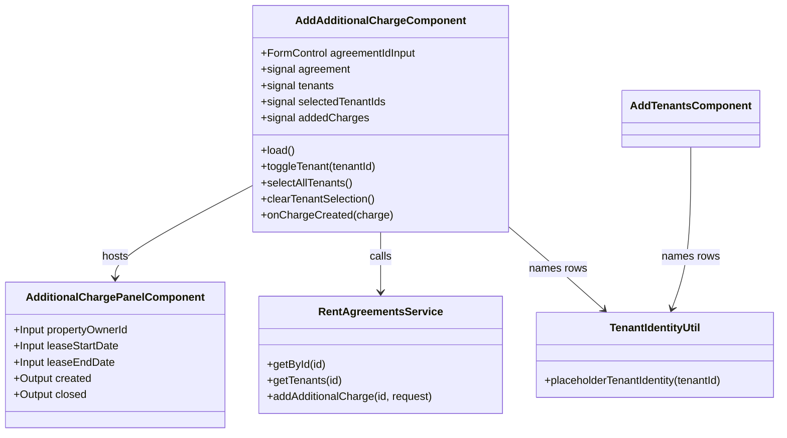

## Changelog

| Version | Date | Summary | Plan |
|---------|------|---------|------|
| v10 | 2026-09-18 | **The page stops listing the renters, because the fee panel already does.** **FR 3 is corrected.** *Raised by the user 2026-09-18 — no need to show the tenant list when adding a fee from this page.* v8 moved the tenant picker into the fee panel and left a read-only roster card behind on the page "for context", which meant the same people were listed twice on one screen: once with their recorded rent and deposit shares, and again in the split editor with a checkbox and an amount each. **The duplicate is the copy that goes stale**, and it is also the one the owner does not need — they are about to pick renters in the panel, not read about them beforehand. The card is removed. **The two warnings it contained stay, because they are a state rather than a list:** a lease whose step 2 was never saved (`204`) still says so and still links to the ADD TENANTS screen (requirement 6), and a saved-but-empty roster still says a fee will be shared by whoever is added later. **What is genuinely lost is the recorded rent and deposit shares** — FR 3 asked for them and no screen shows them now. That is deliberate rather than overlooked: they describe how the *rent* is split, which is a different question from how this fee is, and nothing on this page acted on them. They can be added to the split editor’s subline if they turn out to be wanted. | — |
| v9 | 2026-09-18 | **Each renter gets a box for what they owe and a box for what they have paid, and the paid slice is finally sent.** New **requirement 23**; the Contract table row for `tenantShares` is corrected. *Asked for by the user 2026-09-18 — two boxes, one for the line item and one for the paid amount, each dividing into shares.* **The field was on the wire the whole time and this spec never recorded it.** `AdditionalChargeTenantShareInput` accepts `tenantId`, `amount`, `sharePercent` **and `alreadyPaid`** — read off the service’s own OpenAPI document at `/openapi/v1.json` on 2026-09-18 rather than assumed — and the response has carried a per-renter `alreadyPaid` since the split shipped. The Contract table here listed only the first three, so the client read the field back, never sent it, and had no box to type it into: the charge carried one `alreadyPaid` figure and the **server** divided it. **That is the hazard requirement 17 exists for** — one division shown and a different one stored — and it was live in the paid column for as long as the amounts column was being carefully protected from it. **The split table now has five columns**: Tenants, Shares, **Amount**, **Paid**, **Owes**. Amount and Paid are both typeable and both divide by the identical rule — money, to the cent, leftover cents one each to the renters at the top of the list, typed boxes left alone while untouched boxes absorb the difference — and they are **independent**, so fixing what one renter owes does not disturb what another has paid. **Owes is derived and never typed into.** **Paid is money only**, because there is no `alreadyPaidPercent` on the wire, so that column has no unit to choose. **Both columns must add up**, and the fee is named first when both are wrong: two messages at once names neither clearly. **A negative Owes is shown, not refused** — the charge itself lets `alreadyPaid` exceed its own total, so a stricter rule per renter would be one this screen invented. Also: the split row carries the renter’s id beside the name. The stand-in identities are drawn from 16 × 16 combinations, so two renters on one lease can read as the same person — hit while checking this in the browser, two rows both called *Bilal Mensah* — and these rows carry different money. **No backend change, no contract change:** a field that was always accepted is now sent. | — |
| v8 | 2026-09-18 | **The split editor moves into the fee panel, so the Invoices page gets the same one and the lease editor still gets none.** **FR 4 and FR 5 are corrected; FR 8 is restored; the *"panel is reused, not forked"* constraint is replaced.** *Raised by the user 2026-09-18, asking why the two screens that add a fee do not look alike.* **Both post to the same endpoint with the same field available, and only one of them could use it.** v7 put the tenant picker and the split on this **page**, because the fee panel is shared with the lease create/edit screens and requirement 22 says those must never gain a renter control. The Invoices page hosts that same panel, so it ended up with no way to say who pays at all — spec `04` FR 19 made that deliberate and pointed the user here for a subset. Two screens, one API, one of them able to send `tenantShares`. **The editor now lives in the panel behind a `tenants` input**, and that input is the whole of requirement 22: a host that passes a roster gets the editor, a host that passes none renders no renter control at all. The lease screens pass none. What was an architectural arrangement is now a single assertion, so a change that renders the editor unconditionally fails a test rather than quietly growing a split editor on the lease editor. **FR 8 stands again.** v7 could not satisfy it: the split divides the fee's money, the total lived inside the panel, and the panel is a drawer over a click-to-close dimmer — so nothing behind it could be typed into and Create had to *stage* the fee for a second, page-level Save. Inside the panel the total is already there, so Create posts once again and this page drops its picker, its staged-fee card, its split signals and its submit guard. **FR 4 moves rather than dies:** the selection is still per-row with the two modes, but it happens in the panel; this page keeps the roster as read-only context, which is all FR 3 ever asked for. **FR 5 is corrected** — an empty selection still means *every active renter shares this fee*, but it is now expressed by sending no `tenantShares`, not by `tenantIds: []`, which v7 FR 20 had already stopped sending. **The arithmetic moves to `tenant-split.util.ts`** because three screens divide a fee now and the rules are the part that must not differ between them; the control surface moves to `tenant-split-editor.component`, which also returns this page's stylesheet to under its budget. **No backend change, no contract change** — the same body, from one more screen. | — |
| v7 | 2026-09-17 | **The page gains the split editor the backend has been waiting for, and stops sending the tenant array.** New **requirements 17-22**. The backend shipped a per-tenant split on 2026-09-17 (`06-unified-invoice-generation.md` v105: `payerShares`, renamed to `tenantShares` in v109) and **this page has never sent it** — it still sends `tenantIds` and lets the server divide evenly. So the one thing the owner asked for, *typing what each renter owes*, is unreachable from the only screen that can say who pays. This version adds the editor: ticking renters fills an even division, each row is editable in **money or percentage**, and the rows must total the fee before the save is allowed. It also stops reading the echoed `tenantIds`, which backend v109 removes from the response — **the label naming who a fee landed on breaks the day that ships**, so this release must land first. | [2026-09-17T2200-02-the-owner-types-each-share](../../plans/rent-agreements/2026-09-17T2200-02-the-owner-types-each-share.md) |
| v6 | 2026-09-10 | **The page could not retry a save, and the one status that most deserves a retry is the one it is most likely to get.** New **requirement 16**; the *"idempotency key is out of reach"* constraint is **withdrawn**. `POST …/additional-charges` has keyed replay off the body's `id` since backend FR 57, and answers `200` rather than `201` when it recognises one — but the panel emits no `id`, so the page had nothing to replay with and could only block its own submit while a request was in flight. The page now mints one (`crypto.randomUUID()`) when the panel does not supply it, which costs nothing and makes the submission replayable, and retries **once** on `409` after 400 ms. The `409` is not hypothetical: it was reproduced against the running service by submitting a fee immediately after activating the lease, while that activation's own post-commit issuing pass still held the agreement. That is a lock that clears in well under a second, and the person on this screen has no way to act on being told about it. **Bounded to one attempt, and to `409` alone** — a `422` or a `404` is the user's to fix and reaches them on the first answer, and an unbounded retry on a write turns one slow request into several. | [2026-09-10T1900-02-replay-a-conflicted-fee](../../plans/rent-agreements/2026-09-10T1900-02-replay-a-conflicted-fee.md) |
| v5 | 2026-09-09 | **A fee could be saved with money on it that will never be billed, and this page said nothing — the third time this repository has discarded a report the backend sends on a success.** New **requirement 15**. `POST …/additional-charges` answers with the saved charge *plus* `unbilledLines`: the lines this save could bill nowhere, because every invoice they could have gone on has already taken a payment, and a paid invoice is corrected with a credit or a void rather than an edit (backend FR 101 / spec 04 v8 FR 41). The backend's own contract says it *"is never null, and never absent, so a client reads it unconditionally"* and that *"the defect being closed is not the refusal but the silence"* — **and `grep -rn "unbilledLines" src/` returned nothing at all.** So the owner entered a fee, saw it land in the committed list, and had no way to learn that part of its money reaches no invoice. **Rendered inside the charge's own card, not as a page banner**, because this page adds fees one after another: a disclosure keyed to the fee stays true while a "latest save" banner is overwritten by the next fee, which the third test pins. It is styled `warn` and leaves `submitError` untouched — the fee *was* saved, and the line stays on it. **The pattern, now recorded rather than rediscovered:** `blockedRemovals` (spec 01 v19), `skippedCycles` (spec 06 v1) and now `unbilledLines` were all reported on a `200` and all dropped. Two more remain unread — the schedule preview's `warnings` and `blocked` — and are named in the plan as the next slices rather than left to be found a fourth time. | [2026-09-09T1600-02-surface-unbilled-lines](../../plans/rent-agreements/2026-09-09T1600-02-surface-unbilled-lines.md) |
| v4 | 2026-09-01 | **The fee panel drops Semi-Annual when the lease is month-to-month.** A recurring charge's cadence is resolved against the lease window by the same candidate-date endpoint the lease form uses, and it refuses Semesterly + month-to-month — so the option would have produced a `400` mid-form with nothing on screen to explain it. The panel derives the term from `leaseEndDate` (no end date ⇒ month-to-month), exactly as its candidate-date request already does, and resets a disallowed frequency to Monthly at open time, after any prefill. See spec `01` v18 for the shared rule. | [2026-09-01T1000-month-to-month-frequency-options](../../plans/rent-agreements/2026-09-01T1000-month-to-month-frequency-options.md) |
| v3 | 2026-08-31 | **Picking a line item seeds the row's description with that item's name — but only when the description is still empty.** Picking an item is nearly always followed by typing the same word, so this saves the common keystroke; the emptiness check is what keeps it from being a data loss on the other path, where re-opening a saved charge to correct its type would otherwise overwrite whatever the property owner actually wrote. Applies to both arms of the picker — an existing catalog entry and a typed new item type — and treats a whitespace-only description as empty. New FR 14. (The panel is shared, so the Add Lease/Edit Lease screens and the Invoices page's add panel get this too.) | [2026-08-31T2100-line-item-seeds-description](../../plans/rent-agreements/2026-08-31T2100-line-item-seeds-description.md) |
| v1 | 2026-08-31 | **Initial spec: a standalone "Add Additional Fee" page.** Paste a rent agreement id, the page loads the lease (`GET /rent/agreements/{id}`) and its saved tenants (`GET /rent/agreements/{id}/tenants`), the user ticks which tenants the fee is charged to, builds the fee in the **existing** `AdditionalChargePanelComponent` — reused unchanged, no fork — and the page posts it to `POST /rent/agreements/{id}/additional-charges` with the ticked ids as `tenantIds`. Nothing on the lease-edit page changes: that page still batches its charges into `PUT …/terms`, which remains the only path that can edit or remove one. | [2026-08-31T1200-02-add-additional-charge-ui](../../plans/rent-agreements/2026-08-31T1200-02-add-additional-charge-ui.md) |

## Overview

`AddAdditionalChargeComponent` (`src/app/rent-agreements/add-additional-charge.component.ts`) is the
Angular page behind `/rent-agreements/additional-charges`. It appends **one** additional fee to an
**already saved** lease, charged to a chosen subset of that lease's tenants, through the backend's
`POST /rent/agreements/{id}/additional-charges` endpoint (backend spec `01-rent-agreement.md`
FR-054 – FR-062).

It is deliberately a *second* entry point for additional fees, not a replacement for the one on the
lease screen. The lease screen (spec `01-rent-agreement-edit-ui.md`) collects charges into the
lease's own create/edit body and can edit or delete them; this page can only **add**, but it is the
only place that can add one to a lease that is already saved — and the only place that can say *who
pays it*.

The fee itself is built by the existing `AdditionalChargePanelComponent`, imported and used as-is.
This spec adds no new fee-authoring UI; it adds the lease lookup, the tenant picker, and the wiring
to a different endpoint.

## Business Scope

A property manager needs to bill something that was not known when the lease was written — a
utility recharge, a repair cost, a pet fee — after the lease is saved and possibly after it is
active. Two facts drive the screen:

1. **The fee often belongs to some tenants, not all of them.** A lease with four renters may bill a
   parking fee to exactly one. The backend has modelled this since FR-058 (`tenantIds`), but no
   screen has ever sent it, so every fee raised from this UI has been shared by everyone.
2. **The lease is already saved**, so the fee cannot ride the create body. It needs the append
   endpoint, which commits the charge — and, when the charge stands alone on an active lease, the
   invoice it raises — in one transaction.

Success: a manager pastes a lease id, sees that lease's tenants, ticks the ones who owe the fee,
fills in the same fee panel they already know from the lease screen, and gets back the persisted
charge with its real id.

## Functional Requirements

1. The system shall present a rent agreement id input and shall refuse to load anything until the
   entered text is a well-formed GUID, reporting the malformed id inline rather than calling the API.
2. On load, the system shall fetch the lease (`GET /rent/agreements/{id}`) and its saved tenants
   (`GET /rent/agreements/{id}/tenants`) concurrently, and shall render nothing of the fee UI until
   both answer.
3. ~~The system shall render every **active** tenant the tenants endpoint returns, each with its
   `tenantId`, its recorded rent share and its recorded deposit share, and a stable stand-in name
   derived from the id.~~ **Corrected in v10 — this page renders no roster of its own.** It loads the
   roster and hands it to the fee panel, whose split editor is the one place renters are listed: each
   with a stable stand-in name derived from the id — the same derivation the ADD TENANTS screen uses, so
   the same tenant reads as the same person on both screens — the id beside it, a checkbox, and their
   share of the fee.
   **The recorded rent and deposit shares are no longer shown anywhere**, deliberately: they describe
   how the *rent* is divided, which is a different question from how this fee is, and nothing on this
   page ever acted on them.
4. ~~The system shall let the user select **any number** of those tenants, including none and all,
   with per-row checkboxes plus "Select all" and "Clear" actions.~~ **Corrected in v8 — the selection
   moved into the fee panel.** It is still per-row and still allows none and all, but it is made in
   `app-tenant-split-editor` beside the fee it divides, because the split needs that fee's total and the
   Invoices page needs the same control. This page renders the roster as **read-only context** (FR 3)
   and hands it to the panel.
5. The system shall treat an empty selection as *"every active tenant shares this fee"* and shall say
   so on screen, so an empty selection is never mistaken for an unfinished one. **Corrected in v8:** it
   is carried by sending **no `tenantShares`** (requirement 20), not by `tenantIds: []` — that array
   stopped being sent at v7, and this clause still named it. Both mean the same thing to the server;
   omission states *not specified* where an empty list states *specified as nobody*.
6. When the tenants endpoint answers `204 No Content` (the lease exists but step 2 was never saved),
   the system shall say so, offer a link to that lease's ADD TENANTS screen, and still allow a
   shared fee to be added; it shall not present a tenant picker with nothing in it.
7. The system shall open the existing `AdditionalChargePanelComponent` for fee authoring, passing
   the loaded lease's `propertyOwnerId`, `startDate` and `endDate` so the panel's catalog fetch and
   its candidate-date selects work exactly as they do on the lease screen.
8. On the panel's `created` event the system shall `POST /rent/agreements/{id}/additional-charges`
   **once**, with the panel's charge fields at the body root — **the split among them** (requirement 20)
   — and shall close the panel only after the request succeeds; a failed submission keeps the authored
   fee on screen instead of discarding it.
   **Breached by v7 and restored in v8, which is worth recording.** v7 put the split on this page, so
   Create could only *stage* the fee and a second page-level Save posted it: the split divides the fee's
   money, and the page could not see a total that lived inside the panel. Moving the editor into the
   panel removed the reason, not just the symptom — the total is beside the split now, and one click
   both authors and sends.
9. The system shall render each successfully added charge in a running list on the page — its server
   id, its category, its items and total, its recurrence, and who it was charged to — so a manager
   adding several fees in a row can see what has already been committed.
10. The system shall render a failed submission's RFC 9457 `detail` verbatim when the response body
    carries one, falling back to the status line, and shall keep the lease and its tenants loaded so
    the user can correct and retry without re-entering the id.
11. The system shall not send `isManualInvoice`: the backend accepts and ignores it (every invoice
    this route raises is `Manual` regardless), so sending it would assert a decision the client does
    not make.
12. The system shall not offer edit or delete on an added charge — the endpoint is additive only,
    and the lease screen's `PUT …/terms` remains the only path that changes one.
13. `toChargeCreationRequest` shall carry a loaded charge's `tenantIds` back into the request it
    builds, so a fee this page charged to a subset of tenants is not silently widened to everyone the
    next time the lease screen resubmits its complete charge set through `PUT …/terms`.
14. **v3** — Choosing an item in the fee panel — an existing catalog entry or a typed new item type —
    shall copy that item's name into the row's description **only when the description is empty or
    whitespace**, and shall never overwrite one that already says something.
15. **v5** — The system shall surface a saved charge's `unbilledLines` — each line's description and
    amount — **inside that charge's card in the committed list**, and shall keep each charge's
    disclosure independent of every other save, so a later fee that bills fine does not clear an
    earlier fee's. It shall present this as a **disclosure, not a failure**: `submitError` stays
    untouched, the charge stays in the list, and the wording says the fee was saved and what its
    lines could not do. When `unbilledLines` is absent, `null`, or empty, nothing is shown.

16. **v6** — The system shall put an idempotency key on every submission — the panel's `id` when it
    supplies one, otherwise a freshly minted UUID — and on a `409` shall replay that same submission
    **once**, after a short delay, reporting nothing to the user unless the replay also fails. It
    shall not retry any other status, and shall not retry more than once.

17. **v7** — When the owner ticks renters for a fee, the page shall fill a **per-renter split**
    immediately, dividing the fee **evenly in money** and showing each renter's amount and
    percentage. Untick a renter and the remaining rows re-divide. This is the state the page has
    always sent to the server implicitly; v7 makes it visible and editable before the save.
    **The division is of the money, not the percentage.** `$300` across three renters is
    `100.00 / 100.00 / 100.00`, never `99.99 / 99.99 / 100.02`. When the money does not divide, the
    leftover cents go **one each to the first renters in the listed order** — `$100` across three is
    `33.34 / 33.33 / 33.33`, and across six is four rows of `16.67` and two of `16.66`, never one row
    carrying all four cents.
18. **v7** — The owner shall be able to **type over any row**, in either money or percentage, and the
    page shall record **which unit they typed**. Typing an amount leaves that row's percentage
    derived; typing a percentage leaves its amount derived. The two are not interchangeable: on a
    `$300` fee, `200.00` typed and `66.67` typed are different rows, because `66.67%` of `300` is
    `200.01`. The page sends the typed unit as the backend records it — an amount always, and a
    percentage only when the owner typed one.
19. **v7** — The page shall **refuse the save** while the rows do not total the fee exactly, naming
    the difference — *"the shares total $290.00, the fee is $300.00"* — and offering a **reset to an
    even split**. The typed rows are **kept**, never silently corrected: an owner who has typed three
    numbers and got one wrong wants to see all three, not have the page overwrite their work. The
    backend refuses the same state with `422`, so this is the page refusing before the server does,
    which requirement 16 already established as this page's habit.
20. **v7** — The page shall send the split as **`tenantShares`** — one entry per renter carrying
    `tenantId`, `amount`, and `sharePercent` **only when the owner typed a percentage** — and shall
    **stop sending `tenantIds`**. A fee shared by everybody sends **no `tenantShares`**, which is the
    instruction *"every current and future active renter shares this fee"*; it is the same meaning the
    empty `tenantIds` array carried, read off a different shape.
21. **v7** — The page shall name who a fee landed on from the **saved split**, not from an echoed
    tenant array. `chargePayerLabel` reads `charge.tenantIds` today; backend v109 removes that field
    from the response, so the label would silently empty on the day that ships.
    **This requirement is why the release order is not negotiable.** The backend milestone that drops
    `tenantIds` from the response is blocked on this page shipping first, and its plan says so by
    name.

23. **v9** — The split table shall give each renter **two boxes** — the **amount** they are charged
    and the **amount already paid** of it — and shall derive **Owes** from the two, never taking it
    as input. Both boxes shall divide by the same rule as requirement 17 (money, to the cent,
    leftover cents one each to the renters at the top of the list), both shall leave a typed box
    alone while the untouched boxes absorb the difference, and the two shall be **independent**:
    typing what one renter owes shall not disturb what another has paid.
    **The paid slice is sent as `alreadyPaid` on each share, always, even as `0`.** The charge
    carries one already-paid figure and a server left to divide it could divide it differently —
    the same hazard requirement 17 exists for, and it was live in this column while the amounts
    were being protected from it. `AdditionalChargeTenantShareInput` has accepted the field since
    the split shipped; this spec simply never listed it.
    **Money only.** There is no `alreadyPaidPercent` on the wire, so the paid box has no unit to
    choose — the `$`/`%` selector belongs to the amount box alone (requirement 18).
    **The save is refused while either column does not add up** (requirement 19), and the fee is
    named first when both are wrong, because two messages at once names neither clearly. **A
    negative Owes is shown rather than refused:** the charge itself allows `alreadyPaid` to exceed
    its own total, so a stricter rule per renter would be one this screen invented.

22. **v7** — The **lease editor** shall carry a charge's saved split forward on every terms save,
    exactly as it carries `tenantIds` today. It **does not gain a split editor** — that screen has no
    tenant picker and is not getting one; who pays is authored on this page alone.
    **Why a pass-through screen needs a requirement of its own.** `PUT …/terms` resubmits the
    complete charge, and an omitted field is not "unchanged" — it is removed. The lease editor
    already carries `tenantIds` for this reason and says so in its own comment: *a fee charged to two
    of four tenants would silently become a fee shared by all four the next time the lease screen
    saved.* The split inherits that hazard the moment it replaces the array.
    **The server catches it too, and the two are not redundant.** Backend requirement 182, as revised
    in its v109, refuses a terms save whose charge already holds shares and submits none. That guard
    turns this from a silent loss into a `422` — which is a visible failure on a screen the owner was
    not editing the fee from, so the client fix is what keeps the lease editor usable.

## Constraints

- **Additive only.** `POST …/additional-charges` cannot edit or remove; the page must not imply it can.
- **One charge per submission.** The endpoint takes exactly one charge, so the page submits once per
  panel `created` event and never batches.
- **No tenant-profile service exists.** The tenants endpoint stores shares against a `tenantId` and
  carries no personal fields, so every name/email on this screen is a local stand-in derived from the
  id (the same gap the ADD TENANTS screen documents). Only the `tenantId` leaves the screen.
- **The panel is reused, not forked** — and from v8 it is the panel that owns the tenant selection.
  `AdditionalChargePanelComponent` gains two inputs, `tenants` and `isGroupInvoice`, and keeps its
  `created`/`closed` outputs; `created` now carries `tenantShares`.
  **A `null` roster is what keeps the lease screens unaffected**, and it is a stronger guarantee than
  the old arrangement. Keeping the picker on the host page protected them by construction — there was
  no renter control in the panel to leak — but it also left the Invoices page unable to split a fee it
  was posting to the very endpoint that accepts one. The input inverts that: the lease screens pass no
  roster and render nothing, which is a condition a test can pin, and requirement 22 has one.
- ~~**Idempotency key is out of reach.**~~ **Withdrawn in v6.** The panel still emits no `id`, but the
  page mints one, so the submission is replayable and requirement 16's retry is safe. The in-flight
  block stays — it stops a second *distinct* submission, which a retry never is.

## Contract

### API Endpoints consumed

| Method | Route | Used for | Notable responses |
|--------|-------|----------|-------------------|
| `GET` | `/api/v1/rent/agreements/{id}` | the lease's `propertyOwnerId`, `startDate`, `endDate`, `status`, `scheduleRows` | `404` unknown lease |
| `GET` | `/api/v1/rent/agreements/{id}/tenants` | the active tenants and their shares | `200` saved set, `204` step 2 never saved, `404` unknown lease |
| `POST` | `/api/v1/rent/agreements/{id}/additional-charges` | append one fee | `201` created, `200` replay, `400` malformed or duplicate `tenantIds`, `404` unknown lease, `409` lifecycle forbids editing, `422` business-rule violation |

### Input / Output models

`AddAdditionalChargeRequest` — **the charge's own fields sit at the body root**, not nested under a
`charge` member (backend `AddAdditionalChargeCommandJsonConverter` reads the root element):

| Field | Type | Required | Notes |
|-------|------|----------|-------|
| `notes` | `string \| null` | No | Free text |
| `alreadyPaid` | `number` | Yes | `>= 0` |
| `attachedWithRentalInvoice` | `boolean` | Yes | Rides the rent invoice, or stands alone |
| `isRecurring` | `boolean` | Yes | Gates the fields below |
| `dueDate` | `string \| null` (`YYYY-MM-DD`) | Iff not recurring | |
| `frequency` | `RentFrequency \| null` | Iff recurring **and** attached (FR-088) | |
| `frequencyConfig` | `FrequencyConfig \| null` | Iff `frequency` is set | Polymorphic on `frequency` |
| `startDate` | `string \| null` | Iff recurring | |
| `endDate` | `string \| null` | Iff recurring and not open-ended | |
| `hasNoEndDate` | `boolean` | Yes | |
| ~~`tenantIds`~~ | `string[]` | No | **Not sent from v7** (requirement 20). The backend accepts and ignores it for one release, then removes it |
| `tenantShares` | `TenantShareInput[]` | No | **v7, corrected in v9.** One entry per renter: `tenantId`, `amount`, `sharePercent` only when a percentage was typed, and `alreadyPaid` — that renter’s slice of the charge’s already-paid figure. **`alreadyPaid` was missing from this row until v9** while the service had accepted it all along (`AdditionalChargeTenantShareInput`, verified against `/openapi/v1.json`), so the client read it back and never sent it. **Absent means every active renter shares the fee** — the meaning the empty array carried. Amounts must total the fee exactly, any percentages must total `100.00`, and the paid slices must total the charge’s `alreadyPaid` |
| `items` | `AdditionalChargeItemCreationRequest[]` | Yes | Non-empty |

Response: `RentAgreementAdditionalChargeResponse` — the persisted charge. **Backend v109 removes
`tenantIds` from it** (requirement 21), so from v7 the page names who a fee landed on from the
saved split instead. Until that backend release ships the field is still returned; the page must
not read it, because a page that reads a field scheduled for removal is a page that breaks on a
deployment it does not control.

### Class Diagram

The page persists nothing of its own — it holds no client-side store beyond the signals above — so
this spec carries no Data Model or Table Structure section. The persisted shape is the backend's,
specified in `innago-rent-accounting`'s `docs/specs/rent-agreements/01-rent-agreement.md`.

## Out of Scope

- **Editing or deleting** an additional fee — `PUT …/terms` on the lease screen only.
- **Deposit-flavoured fees.** The panel's `depositOnly` mode is not offered here; a deposit fee is
  added from the lease screen, and the backend refuses a recurring one outright.
- **Searching for a lease.** There is no "list agreements" endpoint, so an id box is the whole
  navigation surface — the same constraint the Open Lease screen documents.
- **Surfacing the raised invoice.** The endpoint's response body is the charge, not the invoice it
  may have raised; the page reports what it is given and does not go looking for the invoice.
