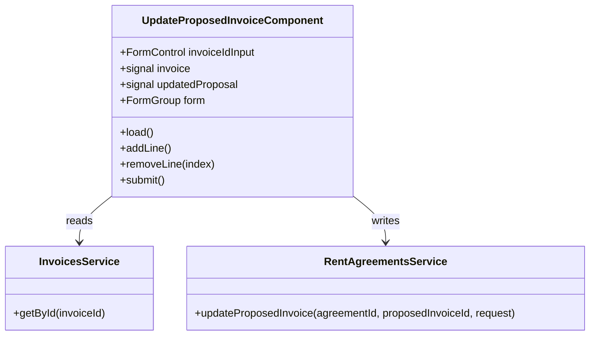

## Changelog

| Version | Date | Summary | Plan |
|---------|------|---------|------|
| v2 | 2026-08-31 | **Two input controls replaced with the ones the rest of the app already uses, on user feedback that v1's form "sahi nahi hai".** (1) **Item type is now the ADD ADDITIONAL FEE panel's catalog picker** — the same "Select Type" button and floating menu, fed by the same `GET /api/v1/line-items`, scoped `DepositOnly` for a deposit invoice and `AllExcludingCredit` otherwise (matching that panel's `depositOnly` mode) — instead of a free-text `itemType` box. Picking sets **both** `lineItemId` and `itemType`, because the endpoint asks them separately: `itemType` is parsed into the `InvoiceItemType` enum and checked against the deposit allowlist, while `lineItemId` names the catalog row and is *required* on every line of a deposit proposal. **The panel's "+ Add Item Type" row is deliberately not carried over**: that panel's endpoint get-or-creates a catalog entry from free text, whereas this one answers `invoice.unrecognized_charge_item_type` for any name outside the enum, so an invented type could only ever be refused. A line with no `lineItemId` — which is what a *rent* line is — labels its button with its stored `itemType` rather than "Select Type", so a perfectly well-typed line does not read as unset. (2) **Due date is now the Material datepicker** the lease form and the fee panel use, so the control holds a native `Date` converted by the existing `toIsoDate`/`parseIsoDate` — never `Date#toISOString`, which shifts to UTC and lands on the previous day west of Greenwich. New FR 14–16. | [2026-08-31T1600-03-update-proposed-invoice-ui](../../plans/rent-agreements/2026-08-31T1600-03-update-proposed-invoice-ui.md) |
| v1 | 2026-08-31 | **Initial spec: a standalone "Update Invoice" page.** Paste an **invoice** id, the page reads it with `GET /invoices/{id}`, renders its due date and line items as an editable table, and submits the correction to `PATCH /rent/agreements/{rentAgreementId}/proposed-invoices/{proposedInvoiceId}` — the two ids taken from the invoice the GET returned, never typed. A true read-modify-write: each line's `lineId` round-trips, so an untouched line stays the same line, an edited one is revised, a removed one is soft-deleted and a new one is added. Depends on backend `02-invoicing.md` **v36**, which added `proposedInvoiceId` to the invoice read for exactly this. | [2026-08-31T1600-03-update-proposed-invoice-ui](../../plans/rent-agreements/2026-08-31T1600-03-update-proposed-invoice-ui.md) |

## Overview

`UpdateProposedInvoiceComponent` (`src/app/invoices/update-proposed-invoice.component.ts`) is the
Angular page behind `/invoices/update`. It corrects **one** invoice: its due date, its line set, or
both.

The read and the write are deliberately different resources, and that is the whole shape of this
screen. What the user recognises is an **invoice** — it has a number, a total, a balance — so that is
what they paste an id for and that is what `GET /api/v1/invoices/{id}` returns. What the backend
actually corrects is the **proposal** behind it: corrections are applied through
`PATCH /api/v1/rent/agreements/{rentAgreementId}/proposed-invoices/{proposedInvoiceId}`, which since
backend `06-unified-invoice-generation.md` FR 101 carries an accepted edit onto an already-issued
invoice by appending to its Marten stream. The page holds both ids together so the user never has to.

## Business Scope

A property manager finds a mistake on an invoice — the due date is wrong, a line is wrong, a line
should not be there. Today there is no screen for it at all: the lease screen edits the *plan*, not an
invoice, and `PUT /api/v1/invoices/{id}` was removed (backend `02-invoicing.md` v34).

Two facts shape the screen:

1. **The correction is addressed by two ids, and only one of them is knowable to a person.** Nobody
   memorises a proposal id. The invoice read now returns it (backend v36), so the page derives it.
2. **A correction is a read-modify-write, not a re-entry.** The `lines` array on the PATCH is the
   **complete** new set: a line the array omits is soft-deleted. So the screen must start from what is
   actually on the invoice, carry each line's identity through untouched, and submit the whole set —
   anything less silently deletes lines the user never touched.

Success: paste an invoice id, see its real lines, change what is wrong, submit, and see the corrected
proposal come back.

## Functional Requirements

1. The system shall present an invoice id input and shall refuse to load until the entered text is a
   well-formed GUID, reporting a malformed id inline rather than calling the API.
2. The system shall load the invoice with `GET /api/v1/invoices/{id}` and render its identifying
   context — invoice number, status, category, total, amount paid, balance, generated-on date — as
   read-only.
3. The system shall prefill the due-date field from the invoice's current `dueDate`, and the line
   table from its `lines`, one row per line, each carrying its `lineId` in the form state.
4. The system shall let the user edit a line's item type, description, quantity and rate; add a line;
   and remove a line — with the removal expressed by the row's absence from the submitted array, which
   is the only shape the endpoint accepts a removal in.
5. The system shall compute each row's amount as quantity × rate and shall never send an `amount`
   field, because the endpoint derives it and a client-supplied total that disagreed with its own
   factors would be unreconcilable.
6. The system shall carry an unchanged line's `lineId` through verbatim, so an untouched line is
   revised rather than deleted-and-recreated — which would change its identity on the invoice.
7. The system shall submit to
   `PATCH /api/v1/rent/agreements/{rentAgreementId}/proposed-invoices/{proposedInvoiceId}`, taking both
   ids from the loaded invoice.
8. The system shall omit `dueDate` from the request when the user has not changed it, and omit `lines`
   when no line was touched — because absence means "leave unchanged" on this endpoint, and sending an
   unchanged set would still record a manual edit.
9. The system shall refuse to submit, with an explanation and no request, when the loaded invoice's
   `proposedInvoiceId` or `rentAgreementId` is `null` — that invoice predates the proposal pipeline
   and cannot be corrected through this route at all.
10. The system shall render a failed submission's RFC 9457 `detail` verbatim when the response carries
    one, falling back to the status line, and shall keep the loaded invoice and the user's edits on
    screen so the correction can be fixed and retried.
11. On success the system shall render the returned `ProposedInvoiceDetailResponse` — the corrected
    due date, amount, and live lines with their ids — and shall re-seed the form from it, so a second
    correction starts from what the server now holds rather than from the pre-edit state.
12. The system shall require every submitted line to carry an item type, a non-empty description, and
    a quantity and rate greater than zero, matching the endpoint's own validation, so an obvious `400`
    is caught before the request.
13. **v2** — The system shall fetch the owner's line-item catalog on load
    (`GET /api/v1/line-items`), scoped `DepositOnly` for a deposit-category invoice and
    `AllExcludingCredit` otherwise, and shall let a line's item type be chosen only from it — using the
    same picker control the ADD ADDITIONAL FEE panel uses. A failed catalog fetch shall leave the
    invoice loaded and correctable, with only the picker empty.
14. **v2** — Choosing a catalog entry shall set **both** the row's `lineItemId` and its `itemType`, and
    the system shall offer no way to invent a new item type here — the endpoint parses `itemType` into
    a fixed enum and refuses anything outside it.
15. **v2** — A line carrying no `lineItemId` — which every generated **rent** line does — shall label
    its picker with the line's own `itemType` rather than a "Select Type" placeholder, so a typed line
    is not presented as an untyped one.
16. **v2** — The due date shall be picked with the same Material datepicker the lease form and the fee
    panel use, and converted to the wire's `YYYY-MM-DD` in **local** time.

## Constraints

- **`lines` is a complete replacement.** A partial array deletes what it omits. The page therefore
  submits every row it is showing, or omits the member entirely.
- **No `amount` on the wire.** Quantity × rate is the amount; the field does not exist on the request.
- **`lineId` types line up by construction, not by luck.** The invoice's `lines[].lineId` *is* the
  proposed line's id — the backend's `ProposalInvoicePlanner` derives each invoice line's identity from
  the proposed line's — so it can be posted straight back as `lines[].lineId`.
- **Not every invoice is correctable.** A payment recorded against the proposal, a cancelled or
  superseded proposal, and an issued **deposit** are refused with `422`; so is a lease whose status
  forbids editing. The page cannot pre-empt these — they are server state — so it renders the refusal.
- **Requires backend `02-invoicing.md` v36.** Against an older backend `proposedInvoiceId` is absent
  and every load reports the invoice as not correctable (FR 9), which is honest rather than broken.

## Contract

### API Endpoints consumed

| Method | Route | Used for | Notable responses |
|--------|-------|----------|-------------------|
| `GET` | `/api/v1/invoices/{id}` | the invoice, its lines, and the two ids the PATCH is addressed by | `200`; `400` empty guid; `404` `invoice.not_found` |
| `PATCH` | `/api/v1/rent/agreements/{id}/proposed-invoices/{proposedInvoiceId}` | the correction | `200` the corrected proposal; `400` malformed body, empty `lines`, duplicate `lineId`, non-positive quantity/rate; `404` unknown agreement or proposal; `409` concurrent write; `422` business rule |

### Input / Output models

`UpdateProposedInvoiceRequest` — **both members are optional and absence means "leave unchanged"**:

| Field | Type | Required | Notes |
|-------|------|----------|-------|
| `dueDate` | `string` (`YYYY-MM-DD`) | No | Omit to keep the current date |
| `lines` | `UpdateProposedLineRequest[]` | No | Omit to keep the current set. **Present ⇒ complete replacement** |

`UpdateProposedLineRequest`:

| Field | Type | Required | Notes |
|-------|------|----------|-------|
| `lineId` | `string` | No | The existing line this revises; omit to add a new line |
| `lineItemId` | `string \| null` | No | Catalog row; required when the proposal's category is deposit |
| `itemType` | `string` | Yes | Parsed case-insensitively server-side |
| `description` | `string` | Yes | |
| `quantity` | `number` | Yes | `> 0` |
| `rate` | `number` | Yes | `> 0` |

Response: `ProposedInvoiceDetailResponse` — `id`, `occurrenceId`, `rentScheduleId?`, `source`,
`category`, `status`, `dueDate`, `amount`, `amountPaid`, `isGroupProposal`, `payers[]`,
`isManuallyUpdated`, `lines[]` (`lineId`, `source`, `lineItemId?`, `itemType`, `description`,
`quantity`, `rate`, `appliedSharePercent?`, `amount`, `isAuthored`).

### Class Diagram

The page persists nothing of its own, so this spec carries no Data Model or Table Structure section.

## Out of Scope

- **Payments, credits, voids and deletes.** The invoice read returns them and the page shows the
  resulting totals, but correcting money is a credit or a void, not an edit.
- **Searching for an invoice.** `GET /invoices` exists and is owner-scoped and paginated; an id box is
  this screen's whole navigation surface, matching Open Lease and Add Additional Fee.
- **Correcting a *planned* proposal that has no invoice yet.** It has no invoice id to be reached by;
  that needs a proposal read endpoint the backend does not have.
- ~~**The line-item catalog picker.**~~ **Brought into scope by v2** — item type is now chosen from the
  owner's catalog with the ADD ADDITIONAL FEE panel's picker, which also supplies the `lineItemId` a
  deposit-category proposal requires on every line.
- **Creating a new catalog entry.** The fee panel can, because its endpoint get-or-creates one from
  free text. This one cannot: `itemType` must already be a member of the backend's `InvoiceItemType`
  enum. A type that does not exist is added from the fee screen, not here.
