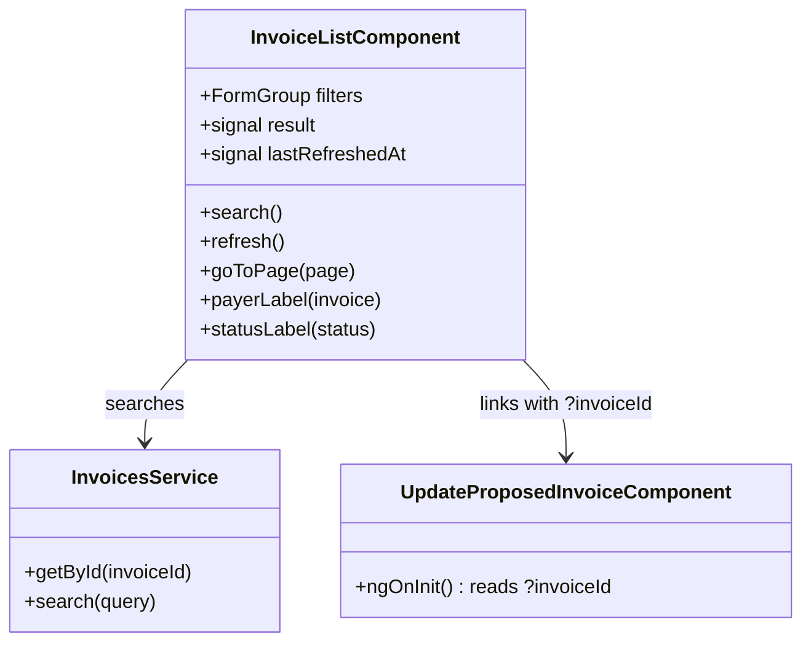

## Changelog

| Version | Date | Summary | Plan |
|---------|------|---------|------|
| v4 | 2026-08-31 | **Filter-bar fix: the two date controls no longer tower over the row.** v3 put them in `mat-form-field`s, which are full-height controls with a floating label and a reserved subscript line — beside this bar's compact inputs they were half again as tall, differently labelled, and visibly out of line (reported by the user with a screenshot). The **calendar is unchanged**: `[matDatepicker]` is a directive on the input and needs no form field, so the picker that opens is still the app's one Material calendar. What is dropped is the wrapper — the input now sits in a plain bordered box styled exactly like its neighbours, inside the same `.filter` label-above wrapper, and is `readonly` so the whole box reads as a button onto the calendar. Also moves `.panel-overlay`, `.close-btn` and `.link-btn` into `src/styles.scss`: each was written out identically in two or three components, and that duplication was what had this file over the 6 kB per-component budget. | [2026-08-31T2000-datepicker-consistency](../../plans/rent-agreements/2026-08-31T2000-datepicker-consistency.md) |
| v3 | 2026-08-31 | **The two due-date filters use the Material datepicker.** They were the last native date inputs on this screen; their controls now hold `Date`s and `buildQuery` converts through `toIsoDate`, so the query string is unchanged and is now produced in LOCAL time rather than by the browser control. `(dateChange)` replaces `(change)` so the page-1 reset still fires. | [2026-08-31T2000-datepicker-consistency](../../plans/rent-agreements/2026-08-31T2000-datepicker-consistency.md) |
| v2 | 2026-08-31 | **An "+ ADD INVOICE" button at the top of the list opens a two-step side panel: type a rent agreement id, then author the fee in the **existing** `AdditionalChargePanelComponent`; on success the list underneath refreshes.** New FR 16–20. **The lease is typed, not taken from a row** — corrected by the user mid-build (*"add new to kisi bhi agreement id ban jayega"*): this adds to **any** lease, including one with no invoices yet, which is precisely the lease that could never appear in an invoice list. Two steps rather than one form because the fee panel cannot render until the lease is loaded — it needs the owner id to fetch the item catalog and the lease dates to resolve a recurring fee's candidate dates. **The refresh is the reason to add from here at all**: on an activated lease a standalone one-off fee raises its own invoice in the same transaction, so the list behind the panel is stale the moment the POST returns. The fee is charged to **every active tenant** (no `tenantIds` sent); the panel says so and points at the Add Additional Fee screen for charging a subset. Also extracts the `.banner` notice styles — duplicated verbatim across three components — into `src/styles.scss`, which removed the duplication and the 6 kB per-component budget breach this page's new panel styles had introduced. | [2026-08-31T1900-04-invoice-list-ui](../../plans/rent-agreements/2026-08-31T1900-04-invoice-list-ui.md) |
| v1 | 2026-08-31 | **Initial spec: the Invoices list.** Built on the **already-implemented** `GET /api/v1/invoices` (backend FR 30–37) — owner-scoped, filtered, paged — plus the two fields backend `02-invoicing.md` **v37** added for this screen: `paidOn` and `tenantIds`. Renders the supplied table design's columns, minus the two nothing in this service can produce: **property/unit names** (opaque external references, no property service) and **Processing** (no in-flight-payment state exists). Rows link straight to the Update Invoice page, which now accepts an `invoiceId` query parameter. | [2026-08-31T1900-04-invoice-list-ui](../../plans/rent-agreements/2026-08-31T1900-04-invoice-list-ui.md) |

## Overview

`InvoiceListComponent` (`src/app/invoices/invoice-list.component.ts`) is the Angular page behind
`/invoices`. It lists one property owner's invoices, filtered and paged, and is the entry point to the
Update Invoice screen.

It needed **no new endpoint**. `GET /api/v1/invoices` has been complete since backend spec
`02-invoicing.md` v28: owner scope, filters on property, unit, tenant lane, agreement, invoice number,
status (repeatable and unioned), invoice type, outstanding-only, inclusive due-date and generated-on
ranges, include-deleted, and a `PagedResult` envelope. What it lacked were two *columns* the design
calls for — when an invoice was paid, and who it is shared by — which v37 added as derived fields.

## Business Scope

A property manager needs one place to see what has been billed and what is outstanding. Until now the
only way into an invoice was to already know its id, which made the Update Invoice screen unreachable
in practice.

Success: pick an owner, see their invoices with balances and statuses, narrow by status or date, and
click through to correct one.

## Functional Requirements

1. The system shall require a property owner id — the endpoint's mandatory scope — and shall refuse to
   search until the entered text is a well-formed GUID, reporting a malformed id inline.
2. The system shall search `GET /api/v1/invoices` and render one row per returned invoice with:
   property and unit references, who the invoice is shared by, due date, paid-on date, invoice number,
   status, total, amount paid, and balance.
3. The system shall render the **status** as a coloured badge, mapping the wire's snake_case values —
   `received` reads "Fully Paid" in green, `overdue` red, `partial_paid` amber, `not_received` neutral,
   `voided` and `deleted` muted.
4. The system shall render an **overdue or unpaid** row's money figures in the same alert colour as its
   badge, and a settled row's in the default colour, so a scan down the page finds what is owed.
5. The system shall name the payers from `tenantIds` using the same stable stand-in identities the ADD
   TENANTS and Add Additional Fee screens derive, falling back to the single `tenantId` payer lane when
   the list is empty, and to "—" when there is neither.
6. The system shall show `propertyId` and `propertyUnitId` as shortened references with the full id
   available on hover — **not** as names, which this service does not hold.
7. The system shall offer filters for status (multi-select), outstanding-only, invoice number, an
   inclusive due-date range, and include-deleted, and shall omit from the query string every filter the
   user did not set.
8. The system shall page through results using the response's `pageNumber`, `totalPages`,
   `hasNextPage` and `hasPreviousPage`, and shall report "showing N of M" from `items.length` and
   `totalCount`.
9. The system shall reset to page 1 whenever a filter changes, because a filter change makes the
   current page number meaningless.
10. The system shall show when the list was last refreshed and offer an explicit "Refresh Now" that
    re-runs the current search unchanged.
11. The system shall link each row to `/invoices/update?invoiceId=<id>`, and that page shall load the
    named invoice on open without the id being retyped.
12. The system shall render an empty result as an explicit "no invoices matched" state, distinct from
    the not-yet-searched state.
13. The system shall render a failed search's RFC 9457 `detail` verbatim, falling back to the status
    line.
14. The system shall **not** display a "Processing" column. No in-flight-payment state exists in this
    service, and a column that always read `$0.00` would present a fabricated figure as a measured one.
15. The system shall **not** offer per-column sorting. The endpoint's order is fixed at `dueDate` then
    `invoiceNumber` and is deliberately not client-selectable, because only a total order makes offset
    pagination stable; sort controls that did nothing would be worse than none.
16. **v2** — The system shall offer an "+ ADD INVOICE" action at the top of the page, available
    **whether or not a search has been run**, since adding does not depend on the list.
17. **v2** — That action shall open a side panel whose first step takes a **typed** rent agreement id —
    never one taken from the listed rows — and shall refuse a malformed or empty id inline, without
    calling the API. The screen adds to any lease, including one that has no invoices yet.
18. **v2** — On a valid id the system shall load the lease (`GET /rent/agreements/{id}`) and only then
    render `AdditionalChargePanelComponent`, passing the lease's `propertyOwnerId`, `startDate`,
    `endDate` and derived month-to-month invoice count. An unknown lease shall be reported on the first
    step rather than advancing.
19. **v2** — On the panel's `created` event the system shall
    `POST /rent/agreements/{id}/additional-charges` once, keep the panel open until the server answers,
    and render a `422` without discarding the authored fee. The fee carries no `tenantIds`, so it is
    charged to every active tenant; the panel shall say so and link to the screen that can charge a
    subset.
20. **v2** — On success the system shall close the panel, confirm what was added, and **re-run the
    current search** so the list reflects any invoice the fee raised — but only when a search has
    already been run, since a refresh without an owner scope would be rejected.

## Constraints

- **Owner scope is mandatory** — no authentication scheme is registered, so an unscoped list would page
  through every owner's billing data. "All invoices" means all of one owner's.
- **No names for property, unit, or tenant.** All three are opaque external references; the client
  shows ids, and derives stand-in *people* for tenants only, as its other screens already do.
- **Fixed ordering**, as above.
- **Page size is capped at 200** by the endpoint, which rejects more; every filter is still a sequential
  JSONB scan until the projection is indexed.
- **Requires backend `02-invoicing.md` v37** for `paidOn` and `tenantIds`. Against an older backend both
  are absent and their columns read "—", which degrades honestly.

## Contract

### API Endpoints consumed

| Method | Route | Used for | Notable responses |
|--------|-------|----------|-------------------|
| `GET` | `/api/v1/invoices` | the filtered, paged list | `200` `PagedResult<InvoiceSummaryResponse>`; `400` validation (missing/empty owner, bad page size, unknown status token) |

### Input / Output models

Query parameters, all optional except `propertyOwnerId`:

| Parameter | Type | Notes |
|-----------|------|-------|
| `propertyOwnerId` | `Guid` | **Required** |
| `page` / `pageSize` | `int` | Default 1 / 50; `pageSize` capped at 200 |
| `invoiceNumber` | `string` | Exact match |
| `status` | `string[]` | Repeatable, unioned. `snake_case` or the member name |
| `invoiceType` | `string` | |
| `outstandingOnly` | `bool` | |
| `dueDateFrom` / `dueDateTo` | `DateOnly` | Inclusive |
| `generatedOnFrom` / `generatedOnTo` | `DateOnly` | Inclusive |
| `includeDeleted` | `bool` | |
| `propertyId` / `propertyUnitId` / `tenantId` / `rentAgreementId` | `Guid` | |

`PagedResult<InvoiceSummaryResponse>`: `items`, `totalCount`, `pageNumber` (1-based), `pageSize`,
`totalPages`, `hasNextPage`, `hasPreviousPage`.

`InvoiceSummaryResponse`: `invoiceId`, `invoiceNumber`, `invoiceType`, `status`, `generatedOn`,
`dueDate`, `total`, `amountPaid`, `balance`, `propertyId`, `propertyUnitId?`, `tenantId?`,
`rentAgreementId?`, `leaseId?`, and — new in backend v37 — `paidOn?` and `tenantIds`.

### Class Diagram

The page persists nothing of its own, so this spec carries no Data Model or Table Structure section.

## Out of Scope

- **Recording payments, voiding, deleting.** The list shows the resulting state; the endpoints for
  those exist but belong to their own screens.
- **Property, unit and tenant names.** Not available in this bounded context — see Constraints.
- **Column sorting and a "Processing" column.** FR 14 and FR 15 explain why each is absent rather than
  pending.
- **Saved filter sets and CSV export.**
