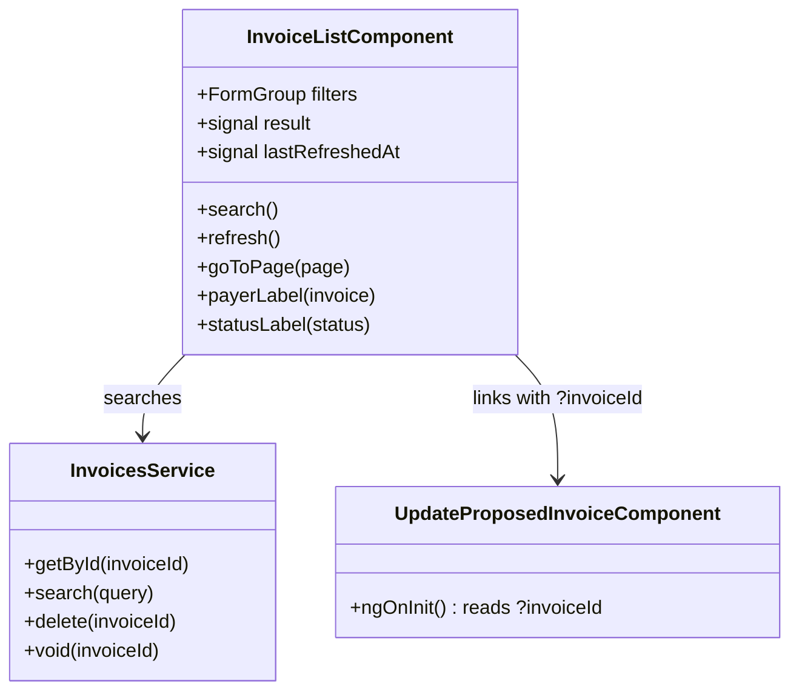

## Changelog

| Version | Date | Summary | Plan |
|---------|------|---------|------|
| v8 | 2026-09-16 | **The list loads itself on open instead of waiting for a click on Search.** New requirement **FR 26**; **FR 12, FR 16 and FR 20 are corrected**. *Requested by the user 2026-09-16, immediately after v7.* **v7 is what makes this correct rather than merely convenient.** While the owner id was typed into the filter bar, an empty screen on open was the only honest state — the component genuinely did not know whose invoices to fetch, and fetching anything would have been a guess. v7 moved that scope to the `PropertyOwnerUid` header, so the answer is fully determined the moment the route resolves: every filter is optional and starts unset, and the first page is the endpoint's own default (page 1, 50 rows, every status, deleted excluded). Asking the user to press Search for it was asking them to confirm a choice they had never made. **`ngOnInit` runs the search; the Search button stays** and re-runs it once filters are narrowed — the button changes meaning from *fetch* to *re-fetch*, which is what it already meant on every subsequent press. **Two guards go with it, and neither is a behaviour this version invents.** (1) The scope-change reload (requirement 15g) was gated on a search having already returned, so a token pasted beforehand fired nothing; the only case that gate still caught was a **failed** first load, where re-reading under the new scope is precisely what the tester pasting the token wants. It is now unconditional. (2) The add-fee success refresh carried `if (this.result())` with a comment about "a request with no owner scope, which the endpoint rejects" — a reason that stopped being true at v7 and a case that stops existing here. **The empty state absorbs the idle state.** "Not yet searched" had no rendering left to own, so the pre-search hint is gone and the `@else` branch now means *the load failed* — the error banner above it already says how, and the hint offers the retry. **The specs carry the cost this moves.** Every test now meets an unprompted request at first change detection; `beforeEach` captures and flushes it as `autoLoad`, which is also what the FR 26 test asserts on. Three tests were rewritten rather than patched, each because its premise rather than its expectation expired: `renders an empty result … distinct from not having searched`, `is available before any search has been run`, and `does not refresh when no search has been run`. **358 specs pass.** **No backend change, no contract change** — the same request is simply issued sooner. | — |
| v7 | 2026-09-16 | **The Property Owner ID filter is removed, because the backend stopped reading it three versions ago and this screen went on collecting it.** **FR 1 is deleted**; **FR 20, the first Constraint and both Contract tables are corrected.** *Found by the user 2026-09-16, asking why the invoice filter carries an owner check at all and whether it differs per environment.* **The field had stopped deciding anything, and the screen did not say so.** Backend `02-invoicing.md` **v39 (FR 47)** moved `GET /api/v1/invoices`' owner scope from the query string to the **`PropertyOwnerUid` header**; **v40 (FR 48)** made the query member unbindable; **v41 (FR 49)** deleted it from `SearchInvoicesQuery` and from the published OpenAPI document. FR 47b is explicit that a query string still carrying `propertyOwnerId` is **ignored**. So since 2026-09-14 the list has resolved under whatever `scopeHeadersInterceptor` sent, while the filter bar named an owner that need not be the same one — **the screen answered confidently about a scope it had not read**, which is the exact failure mode `01-rent-agreement-edit-ui.md` v22 and v26 were each written to close. **The environment question, answered.** The client-side check never varied by build — it is component code with no `environment` branch — but *what it was worth* varies entirely, because the header does: on `local` with no token the scope is the Test scope box; with a token on any build it is the gateway's, derived from the bearer; on `dev`/`qa` with no token no scope header is sent at all and the request is refused before Billing is reached (`scope-headers.interceptor.ts`, requirement 15f/15g). A check that is identical everywhere and load-bearing nowhere is worse than none. **What changes:** the `propertyOwnerId` form control, its input, its two validations (`required`, GUID shape), the `idError` signal and its error line are deleted; `InvoiceSearchQuery` loses the member; `InvoicesService.toParams` starts from an empty `HttpParams`; the idle and empty-state copy stop instructing the user to type an id. **An empty filter bar is now a valid search** — that is the endpoint's own contract, not a loosening invented here. **A withdrawn claim goes with it.** `invoice.models.ts` called the required id *"a security control rather than a convenience"*; backend v39's FR 30 correction states that the rule *"requires the caller to name **an** owner, not to **be** that owner"* and withdraws it. The comment is corrected rather than moved. **FR 47c's open question is answered here** (see *Constraints*): v39 asked that this client be **verified rather than assumed**. `GET /line-items` was migrated at `01-rent-agreement-edit-ui.md` v22; `GET /invoices` was not, and this is that verification, recorded. **No backend change.** | — |
| v6 | 2026-09-03 | **Three fixes reported straight off v5's build: a broken row, a missing column, and a column nobody asked to keep.** (1) The row's cells used `vertical-align: middle`; once the actions cell grew taller than the rest of the row (Correct/Delete/Void stacked, or the inline confirm), every other cell's single line of text floated toward the new taller row's centre, reading as rows colliding into each other — fixed by switching the whole table to `vertical-align: top`. (2) **Delete/Void redesigned as a single ⋮ menu per row**, reusing `RentAgreementCreateComponent`'s own schedule-row kebab-menu technique (a `position: fixed` panel positioned from the clicked button's `getBoundingClientRect()`, rendered as a sibling of the scrolling table wrapper so `.table-scroll`'s overflow cannot clip it) — three permanent stacked links in a ten-column table read as visual noise and left users unsure which line was even clickable; one button and a menu is the fix, not a variant of the same idea. (3) **A Type column**, showing `invoiceType` (Rent, Security Deposit, and the rest of the catalog, labelled the way the backend's own `InvoiceType.GetDisplayName()` reads) — the field was already on every response and simply had no column. (4) **The Unit column is dropped** — removed at the user's request, since the property/unit reference this service can show (an opaque id, not a name) was not earning its column. | [2026-09-03T1600-04-invoice-list-row-menu-and-columns](../../plans/rent-agreements/2026-09-03T1600-04-invoice-list-row-menu-and-columns.md) |
| v5 | 2026-09-03 | **Per-row Delete and Void**, on the already-implemented `DELETE /api/v1/invoices/{id}` and `POST /api/v1/invoices/{id}/void`. New FR 21–25. Both actions render only while a row is not already `voided` or `deleted` (the reverse of the lifecycle component's `isDraft` gating), require an inline "this cannot be undone" confirmation in the row's own action cell, and a success re-runs the current search rather than patching the row locally — the fresh search already applies each verb's own visibility rule (a deleted invoice drops out of the list unless "Include deleted" is checked; a voided one always stays and now reads `voided`). Failures render the backend's RFC 9457 `detail` verbatim, scoped to the row that failed. | [2026-09-03T1400-04-invoice-delete-void-ui](../../plans/rent-agreements/2026-09-03T1400-04-invoice-delete-void-ui.md) |
| v4 | 2026-08-31 | **Filter-bar fix: the two date controls no longer tower over the row.** v3 put them in `mat-form-field`s, which are full-height controls with a floating label and a reserved subscript line — beside this bar's compact inputs they were half again as tall, differently labelled, and visibly out of line (reported by the user with a screenshot). The **calendar is unchanged**: `[matDatepicker]` is a directive on the input and needs no form field, so the picker that opens is still the app's one Material calendar. What is dropped is the wrapper — the input now sits in a plain bordered box styled exactly like its neighbours, inside the same `.filter` label-above wrapper, and is `readonly` so the whole box reads as a button onto the calendar. Also moves `.panel-overlay`, `.close-btn` and `.link-btn` into `src/styles.scss`: each was written out identically in two or three components, and that duplication was what had this file over the 6 kB per-component budget. | [2026-08-31T2000-datepicker-consistency](../../plans/rent-agreements/2026-08-31T2000-datepicker-consistency.md) |
| v3 | 2026-08-31 | **The two due-date filters use the Material datepicker.** They were the last native date inputs on this screen; their controls now hold `Date`s and `buildQuery` converts through `toIsoDate`, so the query string is unchanged and is now produced in LOCAL time rather than by the browser control. `(dateChange)` replaces `(change)` so the page-1 reset still fires. | [2026-08-31T2000-datepicker-consistency](../../plans/rent-agreements/2026-08-31T2000-datepicker-consistency.md) |
| v2 | 2026-08-31 | **An "+ ADD INVOICE" button at the top of the list opens a two-step side panel: type a rent agreement id, then author the fee in the **existing** `AdditionalChargePanelComponent`; on success the list underneath refreshes.** New FR 16–20. **The lease is typed, not taken from a row** — corrected by the user mid-build (*"add new to kisi bhi agreement id ban jayega"*): this adds to **any** lease, including one with no invoices yet, which is precisely the lease that could never appear in an invoice list. Two steps rather than one form because the fee panel cannot render until the lease is loaded — it needs the owner id to fetch the item catalog and the lease dates to resolve a recurring fee's candidate dates. **The refresh is the reason to add from here at all**: on an activated lease a standalone one-off fee raises its own invoice in the same transaction, so the list behind the panel is stale the moment the POST returns. The fee is charged to **every active tenant** (no `tenantIds` sent); the panel says so and points at the Add Additional Fee screen for charging a subset. Also extracts the `.banner` notice styles — duplicated verbatim across three components — into `src/styles.scss`, which removed the duplication and the 6 kB per-component budget breach this page's new panel styles had introduced. | [2026-08-31T1900-04-invoice-list-ui](../../plans/rent-agreements/2026-08-31T1900-04-invoice-list-ui.md) |
| v1 | 2026-08-31 | **Initial spec: the Invoices list.** Built on the **already-implemented** `GET /api/v1/invoices` (backend FR 30–37) — owner-scoped, filtered, paged — plus the two fields backend `02-invoicing.md` **v37** added for this screen: `paidOn` and `tenantIds`. Renders the supplied table design's columns, minus the two nothing in this service can produce: **property/unit names** (opaque external references, no property service) and **Processing** (no in-flight-payment state exists). Rows link straight to the Update Invoice page, which now accepts an `invoiceId` query parameter. | [2026-08-31T1900-04-invoice-list-ui](../../plans/rent-agreements/2026-08-31T1900-04-invoice-list-ui.md) |

## Overview

`InvoiceListComponent` (`src/app/invoices/invoice-list.component.ts`) is the Angular page behind
`/invoices`. It lists one property owner's invoices, filtered and paged, and is the entry point to the
Update Invoice screen. **It loads on open (v8)** — the owner comes from the request scope, not from
the filter bar, so there is nothing to ask for first.

It needed **no new endpoint**. `GET /api/v1/invoices` has been complete since backend spec
`02-invoicing.md` v28: owner scope, filters on property, unit, tenant lane, agreement, invoice number,
status (repeatable and unioned), invoice type, outstanding-only, inclusive due-date and generated-on
ranges, include-deleted, and a `PagedResult` envelope. What it lacked were two *columns* the design
calls for — when an invoice was paid, and who it is shared by — which v37 added as derived fields.

## Business Scope

A property manager needs one place to see what has been billed and what is outstanding. Until now the
only way into an invoice was to already know its id, which made the Update Invoice screen unreachable
in practice.

Success: open the screen, see this owner's invoices with balances and statuses, narrow by status or
date, and click through to correct one. **Which owner is not picked here (v7)** — it is whoever the
session is scoped to, and the screen's job is to show that owner's invoices, not to choose between
owners.

## Functional Requirements

1. **v7 — deleted.** It read: *"The system shall require a property owner id — the endpoint's mandatory
   scope — and shall refuse to search until the entered text is a well-formed GUID, reporting a
   malformed id inline."* **The scope is not the caller's to name any more.** Backend v39 (FR 47) moved
   it to the `PropertyOwnerUid` header and v41 (FR 49) deleted the query member, so this requirement
   described a field the endpoint discarded (FR 47b) while the screen still refused to search without
   it. The system shall take the owner scope from the header `scopeHeadersInterceptor` already attaches,
   shall send **no** `propertyOwnerId` on the query string, and shall treat an empty filter bar as a
   valid search.
2. The system shall search `GET /api/v1/invoices` and render one row per returned invoice with:
   property and unit references, who the invoice is shared by, due date, paid-on date, invoice number,
   status, total, amount paid, and balance.
3. The system shall render the **status** as a coloured badge, mapping the wire's snake_case values —
   `received` reads "Fully Paid" in green, `overdue` red, `partial_paid` amber, `not_received` neutral,
   `voided` and `deleted` muted.
4. The system shall render an **overdue or unpaid** row's money figures in the same alert colour as its
   badge, and a settled row's in the default colour, so a scan down the page finds what is owed.
5. The system shall name the payers from `tenantIds` using the same stable stand-in identities the ADD
   TENANTS and Add Additional Fee screens derive, falling back to the single `tenantId` payer lane when
   the list is empty, and to "—" when there is neither.
6. The system shall show `propertyId` and `propertyUnitId` as shortened references with the full id
   available on hover — **not** as names, which this service does not hold.
7. The system shall offer filters for status (multi-select), outstanding-only, invoice number, an
   inclusive due-date range, and include-deleted, and shall omit from the query string every filter the
   user did not set.
8. The system shall page through results using the response's `pageNumber`, `totalPages`,
   `hasNextPage` and `hasPreviousPage`, and shall report "showing N of M" from `items.length` and
   `totalCount`.
9. The system shall reset to page 1 whenever a filter changes, because a filter change makes the
   current page number meaningless.
10. The system shall show when the list was last refreshed and offer an explicit "Refresh Now" that
    re-runs the current search unchanged.
11. The system shall link each row to `/invoices/update?invoiceId=<id>`, and that page shall load the
    named invoice on open without the id being retyped.
12. The system shall render an empty result as an explicit "no invoices matched" state. ~~distinct from
    the not-yet-searched state~~ — **corrected at v8**: there is no not-yet-searched state left to be
    distinct from, since the list loads on open (FR 26). The `@else` branch now means the load
    **failed**, and shall offer the retry rather than an instruction to search.
13. The system shall render a failed search's RFC 9457 `detail` verbatim, falling back to the status
    line.
14. The system shall **not** display a "Processing" column. No in-flight-payment state exists in this
    service, and a column that always read `$0.00` would present a fabricated figure as a measured one.
15. The system shall **not** offer per-column sorting. The endpoint's order is fixed at `dueDate` then
    `invoiceNumber` and is deliberately not client-selectable, because only a total order makes offset
    pagination stable; sort controls that did nothing would be worse than none.
16. **v2** — The system shall offer an "+ ADD INVOICE" action at the top of the page, available
    **whatever the list holds** — ~~whether or not a search has been run~~ (**v8**: it always has been)
    — since adding does not depend on the list. The lease this screen most needs to add to is the one
    with no invoices yet, which can never appear in the rows.
17. **v2** — That action shall open a side panel whose first step takes a **typed** rent agreement id —
    never one taken from the listed rows — and shall refuse a malformed or empty id inline, without
    calling the API. The screen adds to any lease, including one that has no invoices yet.
18. **v2** — On a valid id the system shall load the lease (`GET /rent/agreements/{id}`) and only then
    render `AdditionalChargePanelComponent`, passing the lease's `propertyOwnerId`, `startDate`,
    `endDate` and derived month-to-month invoice count. An unknown lease shall be reported on the first
    step rather than advancing.
19. **v2** — On the panel's `created` event the system shall
    `POST /rent/agreements/{id}/additional-charges` once, keep the panel open until the server answers,
    and render a `422` without discarding the authored fee. The fee carries no `tenantIds`, so it is
    charged to every active tenant; the panel shall say so and link to the screen that can charge a
    subset.
20. **v2** — On success the system shall close the panel, confirm what was added, and **re-run the
    current search** so the list reflects any invoice the fee raised. ~~but only when a search has
    already been run~~ — **the condition is deleted at v8.** v7 had already retired its stated reason
    (a refresh without an owner scope would be rejected — untrue once the scope moved to the header),
    and FR 26 retires the case itself: the list is never un-fetched, so the refresh is unconditional.
21. **v5** — The system shall offer **Delete** and **Void** on any row whose status is neither `voided`
    nor `deleted`, and shall hide both once either terminal status is reached.
22. **v5** — Choosing either action shall show an inline confirmation, in that row's own action cell,
    stating that the action cannot be undone, before calling `DELETE /api/v1/invoices/{id}` or
    `POST /api/v1/invoices/{id}/void`; choosing "Cancel" shall abandon it without calling the API.
23. **v5** — While a row's delete/void request is in flight, that row's confirm/cancel controls shall be
    disabled; other rows shall remain fully interactive.
24. **v5** — On a successful (`204`, including an idempotent repeat) delete or void, the system shall
    show a confirmation banner naming the invoice and the action taken, then **re-run the current
    search** rather than editing the row's status locally.
25. **v5** — On a failed delete or void (`404` `invoice.not_found` or `422`
    `invoice.has_received_payment`), the system shall render the backend's RFC 9457 `detail` verbatim in
    that row's action cell, and shall leave the row's data unchanged.
26. **v8** — The system shall **search on open**, without waiting for the Search button, issuing the
    endpoint's own default page (page 1, 50 rows, every status, deleted excluded) with no filter set.
    The Search button shall remain, re-running the search once filters are narrowed. This is only
    correct because FR 1 was deleted at v7: with the owner scope on the header rather than in the
    filter bar, nothing about the first page waits on the user, so an empty screen on open would
    withhold an answer already determined.
26a. **v8** — The scope-change reload (`01-rent-agreement-edit-ui.md` requirement 15g) shall be
    **unconditional** on this screen. It was gated on a search having returned; the only case that
    gate still caught was a *failed* first load, where re-reading under a newly pasted token is what
    the tester is asking for.

## Constraints

- **Owner scope arrives as a header, not a filter (v7).** ~~Owner scope is mandatory — no authentication
  scheme is registered, so an unscoped list would page through every owner's billing data.~~ Backend
  `02-invoicing.md` **v39 FR 47** moved it to `PropertyOwnerUid`, **v40 FR 48** made the query member
  unbindable, **v41 FR 49** deleted it outright. This screen therefore sends no owner on the query
  string, and the list is still one owner's — the one `scopeHeadersInterceptor` names. **The security
  half of the old wording is withdrawn at the backend's own request:** requiring an id made the caller
  name *an* owner, not *be* that owner, so it never prevented enumeration. Nothing on this endpoint is
  authenticated yet.
- **FR 47c, answered (v7).** Backend v39 asked that `rent-schedule-ui` be *"verified rather than
  assumed"* and the answer recorded. **The answer is: one of the two endpoints needed a change and got
  it late.** `GET /line-items` was migrated at `01-rent-agreement-edit-ui.md` v22 — its owner argument
  is gone and the header is the only source. `GET /invoices` was missed, and kept sending the parameter
  (harmlessly discarded) behind a client-side gate that blocked the user for two days. Anyone reading
  FR 47c as "the client needed no change" should read this row instead.
- **Which owner the header names depends on the build (v7).** `local` with no token: the Test scope box.
  Any build with a token: the gateway's, from the bearer. `dev`/`qa` with no token: no scope header at
  all, and the gateway refuses before Billing is reached. See `scope-headers.interceptor.ts` and
  `01-rent-agreement-edit-ui.md` requirement 15f/15g. This screen has no say in it, which is the point.
- **No names for property, unit, or tenant.** All three are opaque external references; the client
  shows ids, and derives stand-in *people* for tenants only, as its other screens already do.
- **Fixed ordering**, as above.
- **Page size is capped at 200** by the endpoint, which rejects more; every filter is still a sequential
  JSONB scan until the projection is indexed.
- **Requires backend `02-invoicing.md` v37** for `paidOn` and `tenantIds`. Against an older backend both
  are absent and their columns read "—", which degrades honestly.

## Contract

### API Endpoints consumed

| Method | Route | Used for | Notable responses |
|--------|-------|----------|-------------------|
| `GET` | `/api/v1/invoices` | the filtered, paged list. **v7** — Header: `PropertyOwnerUid` (required, attached by `scopeHeadersInterceptor`) | `200` `PagedResult<InvoiceSummaryResponse>`; `400` validation (missing/invalid `PropertyOwnerUid` header, bad page size, unknown status token) |
| `DELETE` | `/api/v1/invoices/{id}` | **v5** — soft-delete a row | `204` (idempotent repeat also `204`); `404` `invoice.not_found`; `422` `invoice.has_received_payment` |
| `POST` | `/api/v1/invoices/{id}/void` | **v5** — void a row, leaving it listed | same response shape as `DELETE`, above |

### Input / Output models

Query parameters, **all optional (v7)** — `propertyOwnerId` is no longer among them; it left the
contract at backend v41 (FR 49) and a stale one sent anyway is discarded (FR 47b):

| Parameter | Type | Notes |
|-----------|------|-------|
| `page` / `pageSize` | `int` | Default 1 / 50; `pageSize` capped at 200 |
| `invoiceNumber` | `string` | Exact match |
| `status` | `string[]` | Repeatable, unioned. `snake_case` or the member name |
| `invoiceType` | `string` | |
| `outstandingOnly` | `bool` | |
| `dueDateFrom` / `dueDateTo` | `DateOnly` | Inclusive |
| `generatedOnFrom` / `generatedOnTo` | `DateOnly` | Inclusive |
| `includeDeleted` | `bool` | |
| `propertyId` / `propertyUnitId` / `tenantId` / `rentAgreementId` | `Guid` | |

`PagedResult<InvoiceSummaryResponse>`: `items`, `totalCount`, `pageNumber` (1-based), `pageSize`,
`totalPages`, `hasNextPage`, `hasPreviousPage`.

`InvoiceSummaryResponse`: `invoiceId`, `invoiceNumber`, `invoiceType`, `status`, `generatedOn`,
`dueDate`, `total`, `amountPaid`, `balance`, `propertyId`, `propertyUnitId?`, `tenantId?`,
`rentAgreementId?`, `leaseId?`, and — new in backend v37 — `paidOn?` and `tenantIds`.

**v5** — `DELETE /api/v1/invoices/{id}` and `POST /api/v1/invoices/{id}/void` take no body and return
`204 No Content` with no body on success; on failure both return an RFC 9457 Problem Details body whose
`detail` is rendered verbatim.

### Class Diagram

The page persists nothing of its own, so this spec carries no Data Model or Table Structure section.

## Out of Scope

- **Recording payments.** The list shows the resulting state; the payment-recording endpoint exists but
  belongs to its own screen. (Voiding and deleting moved **in** scope at v5 — see FR 21–25.)
- **Property, unit and tenant names.** Not available in this bounded context — see Constraints.
- **Column sorting and a "Processing" column.** FR 14 and FR 15 explain why each is absent rather than
  pending.
- **Saved filter sets and CSV export.**
- **Un-delete / un-void.** Neither endpoint offers a reversal, so this screen has no restore action.
