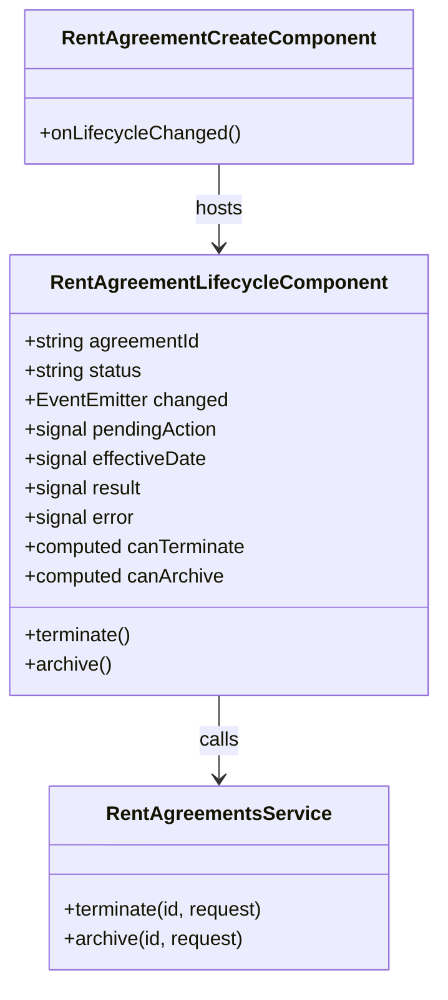

## Changelog

| Version | Date | Summary | Plan |
|---------|------|---------|------|
| v1 | 2026-09-02 | **Initial spec: ending a lease early and withdrawing it, from the Edit Lease screen.** A new `RentAgreementLifecycleComponent` offers **Terminate** (with an effective date) and **Archive**, calling the backend's `POST …/{id}/terminate` and `POST …/{id}/archive` (backend spec `01-rent-agreement.md` v74, FR-094 – FR-107). It sits beside the existing `ActivateLeaseComponent` and **gates on the lease's reported `status`** — which is only now possible: until backend v73 that field answered `InProcess` for every lease however long it had been active, so no screen could trust it. Archive is presented as irreversible, because it is: the backend exposes no un-archive (FR-107). | [2026-09-02T1800-05-rent-agreement-lifecycle-ui](../../plans/rent-agreements/2026-09-02T1800-05-rent-agreement-lifecycle-ui.md) |

## Overview

`RentAgreementLifecycleComponent` (`src/app/rent-agreements/rent-agreement-lifecycle.component.ts`) is the lease-level
control for **ending** a lease. It offers two actions against an already-saved, already-activated
lease:

- **Terminate** — the lease ends on a date the user picks. Cycles scheduled after that date are
  withdrawn; everything on or before it stands.
- **Archive** — the lease is withdrawn as of today, and locked against any further editing or billing.

It is deliberately a sibling of `ActivateLeaseComponent` rather than an extension of it: activation
opens a lease's billing gate, these two close it, and all three are lease-level actions that belong on
the same screen. It is placed on **Edit Lease** (`/rent-agreements/:id/edit`), beside the activate
control.

**What this component does not do:** it never decides what happens to the money. The backend's
recompute removes the withdrawn cycles' unissued invoices, corrects issued-unpaid ones forward, and
leaves anything paid or past-due untouched. The component reports what the response says was withdrawn
and reloads the lease; it computes nothing about invoices itself.

## Business Scope

A tenant gives notice, or a lease is signed and then falls through. Today the only way to reflect that
in this app is to edit the schedule row by row, which is both laborious and wrong — it cannot express
*when* the lease ended, so nothing downstream can reason about the term that was actually served.

**Stakeholder:** the property manager, working from the Edit Lease screen on a lease they can already
see and edit.

**Success looks like:** ending a lease is one action with one date, the screen states plainly what it
withdrew, and the lease's status afterwards reads back correctly without a reload of the page.

**Explicitly not in scope:** reversing either action. The backend has no un-archive or un-terminate
(backend FR-107), so neither is offered — and the archive confirmation says so, rather than letting a
user discover it afterwards.

## Functional Requirements

1. The component shall accept a lease id and the lease's currently reported `status`, and shall offer
   only the actions that status permits.
2. The system shall offer **Terminate** and **Archive** when the reported status is `Active`,
   `Expiring` or `Future` — a lease whose billing gate is open and which has not already ended.
3. The system shall offer **neither** action when the reported status is `InProcess`: an unactivated
   draft has nothing to withdraw, and the backend refuses to archive one (`422`).
4. The system shall offer **Archive only** when the reported status is `Terminating` or `Terminated` —
   a termination is already recorded, and re-terminating with a different date is a correction the
   screen does not currently expose.
5. The system shall offer **no actions** when the reported status is `Archived`, and shall say so:
   archival is terminal.
6. The system shall require an **effective date** for a termination, defaulting to today, and shall
   send it as the request's `effectiveDate`.
7. The system shall confirm before either action, and the **archive** confirmation shall state that it
   cannot be undone.
8. The system shall report, after a termination, whether the lease is now `Terminating` or
   `Terminated` and how many cycles were withdrawn — taken from the response, never computed
   client-side.
9. The system shall present a **repeat** as a success rather than an error: the endpoints are
   idempotent by contract, and the response's `alreadyTerminated` / `alreadyArchived` flag is stated
   plainly rather than shown as a green banner claiming work was done.
10. The system shall render a failure's RFC 9457 `detail` verbatim, matching how every other
    rent-agreement screen reports one, so the backend's own wording reaches the user.
11. The system shall emit a change event after any successful call — including a repeat — so the host
    screen re-reads the lease and its status chip and schedule update without a page reload.
12. The system shall send `version: 1` on both calls, as `ActivateLeaseComponent` already does.
    Nothing in this app issues versions, the detail response does not expose the stored one, and the
    backend's fence rejects only a version *below* what is stored — so a constant 1 passes after an
    activation that also sent 1.

## Constraints

- **No new dependency.** Angular signals, `HttpClient` and the existing `RentAgreementsService`, as
  every other screen here uses.
- **The status strings are the backend's**, unmodified: `InProcess`, `Future`, `Active`, `Expiring`,
  `Expired`, `Terminating`, `Terminated`, `Archived`. The component must not invent or re-case them —
  renaming one is a visible contract change on the backend side.
- **The component owns no money logic.** Cycle counts and statuses come from the response.
- **The effective date is sent as a plain `YYYY-MM-DD` date**, not an instant: it is a calendar date in
  the property's own zone on the backend, and converting through a timezone would shift it.

## Contract

### API calls

| Method | Route | Body | Success | Failure |
|--------|-------|------|---------|---------|
| `POST` | `/api/v1/rent/agreements/{id}/terminate` | `{ effectiveDate, terminatedAt, version }` | `200` — `TerminateRentAgreementResponse` | `404` unknown lease; `409` stale version or already archived; `422` effective date before the lease's begin date |
| `POST` | `/api/v1/rent/agreements/{id}/archive` | `{ archivedAt, version }` | `200` — `ArchiveRentAgreementResponse` | `404`; `409` stale version; `422` lease never activated |

### Input / Output models

Added to `src/app/rent-agreements/rent-agreement.models.ts`:

```ts
export interface TerminateRentAgreementRequest {
  /** The day the lease ends, `YYYY-MM-DD`. Also the cutoff: cycles after it are withdrawn. */
  effectiveDate: string;
  /** When the termination was recorded — now, as an ISO instant. Audit only. */
  terminatedAt: string;
  /** The ordering fence. See FR 12 for why this is always 1 here. */
  version: number;
}

export interface TerminateRentAgreementResponse {
  agreementId: string;
  /** The **stored** effective date, which on a repeat is the one the first call recorded. */
  effectiveDate: string;
  /** `Terminating` while the effective date is ahead, `Terminated` on and after it. */
  status: string;
  /** `true` when the same effective date was already recorded and nothing changed. Still a `200`. */
  alreadyTerminated: boolean;
  /** Cycles this call withdrew — always `0` on a repeat. Counts intent, not invoices. */
  cyclesCancelled: number;
}

export interface ArchiveRentAgreementRequest {
  /** When the archival was recorded — now. Also the source of the cutoff, resolved server-side. */
  archivedAt: string;
  version: number;
}

export interface ArchiveRentAgreementResponse {
  agreementId: string;
  /** The **stored** instant; a repeat keeps the original. */
  archivedAt: string;
  /** Always `Archived`, which outranks every other status. */
  status: string;
  alreadyArchived: boolean;
  cyclesCancelled: number;
}
```

### Component contract

```ts
@Input({ required: true }) agreementId!: string;
@Input({ required: true }) status!: string;
@Output() readonly changed = new EventEmitter<void>();
```

`status` is the lease's reported status, straight from `RentAgreementDetailResponse.status`. The host
passes it and re-passes it after reloading, so the offered actions follow the lease.

### What each status offers (FR 2 – FR 5)

| Reported status | Terminate | Archive | Shown instead |
|---|---|---|---|
| `InProcess` | — | — | "Activate this lease before ending it." |
| `Future`, `Active`, `Expiring` | ✅ | ✅ | — |
| `Terminating`, `Terminated` | — | ✅ | The recorded end date |
| `Expired` | — | ✅ | — |
| `Archived` | — | — | "Archived. This lease is closed." |

### Class Diagram



### Data Model

None. This component persists nothing of its own; every value it shows comes from a response or from
the one form field it collects.

### Table Structure

None — this is a client.

## Out of Scope

- **Un-archive and un-terminate.** The backend has none (FR-107): reversing an archive there would
  restore the lease without the invoices it removed. Offering a button for it would be offering a
  promise the server cannot keep.
- **Correcting a recorded termination date.** The backend accepts it — a second call with a different
  date re-cuts the schedule — but the screen does not expose it yet, because the confirmation would
  need to explain that cycles can come back as well as go, and that is its own design.
- **Merging with `ActivateLeaseComponent`.** Now that `status` is trustworthy, the activate control
  could gate on it too and the three actions could share one component. Worth doing; not done here, so
  that this change stays reviewable. `ActivateLeaseComponent`'s doc comment is corrected in the
  meantime, because it currently explains at length that `status` cannot be trusted.
- **Proration.** There is none: the backend charges the full cycle containing the effective date
  (backend FR-101), so there is no part-month figure for this screen to show.
