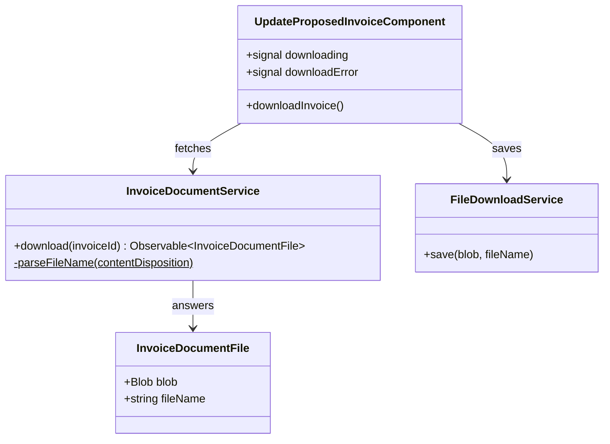

## Changelog

| Version | Date | Summary | Plan |
|---------|------|---------|------|
| v1 | 2026-10-05 | **Initial spec: the Update Invoice page gains a DOWNLOAD INVOICE button that saves the invoice as a PDF.** Backend `13-invoice-download.md` v3 renders one invoice through Gotenberg and answers `GET /invoices/{id}/document` with the **bytes** — `application/pdf` plus `Content-Disposition: attachment; filename="invoice-{invoiceNumber}.pdf"` — rather than a link to a stored artifact (its **D2**, reversed in its v2, **BR-01**/**BR-25**). That reversal moved a cost onto this application, and named it: *"the portal must consume a file response rather than navigate to a link"* (its **Assumption 5**). This spec is that consumption. The request is read as a `Blob`, the filename is taken from the response header with the invoice number as the fallback, and the file is handed to the browser through an object URL — no new route, no new tab, no second request. The button is deliberately **not** gated on the page's `isCorrectable`: an invoice with no proposal behind it, and a deleted or voided one, all still render a document (**BR-16**), and refusing to download what the server will happily print would be this screen inventing a rule. | [2026-10-05T1700-07-invoice-download-ui](../../plans/rent-agreements/2026-10-05T1700-07-invoice-download-ui.md) |

## Overview

`InvoiceDocumentService` (`src/app/invoices/invoice-document.service.ts`) and the DOWNLOAD INVOICE
button on `UpdateProposedInvoiceComponent` are the client half of backend
`13-invoice-download.md` — the printable face of one invoice, saved as a PDF.

**The endpoint returns a file, not a link, and that is the whole shape of this feature.** Every other
call this application makes answers JSON that a component renders. This one answers bytes that the
*browser* has to be handed. So it is the only request in the app with `responseType: 'blob'`, the only
one that reads a response **header** for meaning, and the only one whose success produces nothing on
screen at all — the proof it worked is a file in the downloads folder.

It lives on the Update Invoice page (`/invoices/update`, spec
[`03-update-proposed-invoice-ui.md`](03-update-proposed-invoice-ui.md)) because that page has already
done the one thing a download needs: it has resolved an invoice id to a real invoice and put its
number on screen. It is written as its **own module** rather than as another of that page's
requirements because nothing about it belongs to correcting an invoice — the service takes an id and
answers a file, and the invoice list's rows are the obvious second caller.

## Business Scope

A property manager has the invoice open, has perhaps just corrected it, and now needs to *send* it —
to the tenant, to an accountant's month-end pack, into a dispute, into the lease file. JSON is not a
document and a screen is not an attachment. Until backend `13` there was nothing to send for any
Billing-raised invoice; the monolith still printed its own, so the same portal produced a PDF for one
invoice and nothing for the next, and the gap was invisible until somebody clicked.

Three facts shape the client:

1. **The bytes come back on the request itself.** There is no artifact, no URL, no retention policy —
   backend **D6** is closed, not deferred. So the client cannot navigate; it must hold a `Blob` and
   drive the save itself.
2. **The server names the file.** `invoice-{invoiceNumber}.pdf` (**BR-25**), chosen so a saved file
   identifies the invoice rather than reading `document.pdf`. Honouring that name means reading
   `Content-Disposition`, which is the one piece of a response this application has never looked at.
3. **A failure is an RFC 9457 body in a `Blob`.** `404 invoice.not_found`, `502
   invoice_document.render_failed` (**BR-21** — the monolith's `catch { return ""; }` is deliberately
   not ported). Because the request asked for a blob, the error body arrives as one too, so the
   existing `err.error?.detail` reading finds nothing and must be taught to unwrap it.

Success: click DOWNLOAD INVOICE on a loaded invoice, get `invoice-INV-092026-000042.pdf` in the
downloads folder; and when the renderer is down, read *why* instead of saving a broken file.

## Functional Requirements

1. The system shall present a **DOWNLOAD INVOICE** control on the Update Invoice page, rendered only
   once an invoice has been loaded — before that there is no id the button could be about.
2. The system shall fetch the document with `GET /api/v1/invoices/{id}/document`, reading the response
   as a `Blob` and keeping the whole `HttpResponse` so the headers survive the read.
3. The system shall send **no `audience` parameter**, taking the endpoint's default `owner` view. The
   endpoint also accepts `tenant` and `refund` (**BR-26**); offering a choice is out of scope, and
   sending `audience=owner` explicitly would differ from omitting it only by being one more thing that
   can be mistyped.
4. The system shall name the saved file from the response's `Content-Disposition` header, preferring
   the RFC 5987 `filename*` form over `filename`, unquoting it and discarding any path separators it
   carries.
5. The system shall fall back to **`invoice-{invoiceNumber}.pdf`** — the server's own naming rule
   (**BR-25**) — when the header is absent or unparseable, so a missing header costs the file's name
   and nothing else. The fallback is built where the invoice number is known, which is the page, not
   the service.
6. The system shall save the file by creating an object URL, clicking a generated `download` anchor,
   and **revoking that URL afterwards**, so a session of repeated downloads does not retain every PDF
   it has ever fetched in memory.
7. The system shall offer the download for **every loaded invoice**, including one that reports
   `proposedInvoiceId: null` and one that is deleted or voided — all of which still render (**BR-16**).
   The button is therefore **not** gated on the page's `isCorrectable`.
8. The system shall disable the control while a download is in flight and report that state on it, so a
   slow render reads as progress rather than as a dead button and is not re-requested. Each click
   re-renders server-side (**BR-20**); there is nothing to cache and no second click to coalesce.
9. The system shall treat a **zero-length body as a failure** and shall save nothing, reporting it as
   an empty document. **BR-21** states the endpoint never answers `200` with an empty body — this
   guards the monolith's defect, which does exactly that, in case this screen is ever pointed at it.
10. The system shall render a failed download's RFC 9457 `detail` by **reading the error `Blob` as
    text and parsing it as JSON**, falling back to the status line when the body is not Problem
    Details — because `responseType: 'blob'` delivers the error body as a `Blob` too, and the page's
    existing `err.error?.detail` reading would otherwise report a status line for every failure.
11. The system shall report a download failure in **its own message**, leaving the loaded invoice, the
    form and any typed-but-unsent correction exactly as they were — a download is a read, and nothing
    about it invalidates an edit in progress.
12. The system shall clear any previous download failure when a new invoice is loaded and when a new
    download is started, so a stale message cannot outlive what it was about.

## Constraints

- **The response header is readable because every build is same-origin.** `environment.apiBaseUrl` is
  `''`, `/billing` or `/api`, and the dev-server proxies the first two, so no CORS layer filters the
  response headers. The Billing API's CORS policy exposes `X-Correlation-Id`, `ETag` and the rate-limit
  headers — **not `Content-Disposition`** — so if this application is ever served cross-origin from the
  API, FR 4 silently stops working and FR 5's fallback is what keeps the file sensibly named. That is
  the intended degradation, and it is the reason the fallback is a named requirement rather than a
  convenience.
- **The bytes are not stored anywhere, by either side.** The server renders fresh per request
  (**BR-20**) and keeps nothing; this client holds the `Blob` only until the anchor click and revokes
  its URL immediately after. There is no download history and no "re-download the last one".
- **`application/pdf` is the only non-JSON response this application consumes.** `InvoicesService` is
  modelled on typed JSON reads and the download fits none of its signatures, so it is a separate
  service rather than a method that breaks that file's shape.
- **Requires backend `13-invoice-download.md` v2 or later.** Against v1's contract the endpoint
  answered a JSON envelope carrying a URL, which this client would save as a `.pdf` file full of JSON.
  There is no version negotiation; the contract is the bytes.
- **The browser's own PDF viewer is not involved.** The anchor carries `download`, so the file is
  saved rather than opened in a tab. Opening it would be a different feature with a different failure
  mode (popup blockers), and the request a manager has is to *send* the invoice.

## Contract

### API Endpoints consumed

| Method | Route | Used for | Notable responses |
|--------|-------|----------|-------------------|
| `GET` | `/api/v1/invoices/{id}/document` | the rendered invoice PDF | `200` `application/pdf` + `Content-Disposition: attachment; filename="invoice-{invoiceNumber}.pdf"`; `400` `invoice_document.invalid_audience` (unreachable from here — no `audience` is sent); `404` `invoice.not_found`; `502` `invoice_document.render_failed` |

### Input / Output models

Request: none. The invoice id is the route, the scope rides the existing `scopeHeadersInterceptor`
headers (or the bearer on the dev/qa builds), and no `audience` is sent (FR 3).

`InvoiceDocumentFile` — what `InvoiceDocumentService.download` answers, a faithful report of the
response rather than a decision about it:

| Field | Type | Notes |
|-------|------|-------|
| `blob` | `Blob` | The PDF bytes as delivered. `size === 0` is a failure (FR 9), not an empty document |
| `fileName` | `string \| null` | The name parsed out of `Content-Disposition`; `null` when the header is absent or unparseable, which is the caller's cue to apply FR 5's fallback |

### Class Diagram

`FileDownloadService` is injectable rather than an exported function for one reason: it is the only
code in the application that touches `URL.createObjectURL` and clicks an anchor, and a component test
that could not replace it would make the browser download a file on every run.

The page persists nothing of its own, so this spec carries no Data Model or Table Structure section.

## Out of Scope

- **Downloading from the invoice list.** `InvoiceDocumentService` takes an id and nothing else, so a
  row menu item is a template change and a call — but the list's row menu is spec
  [`04-invoice-list-ui.md`](04-invoice-list-ui.md)'s, and widening it is that spec's version, not this
  one's.
- **The `tenant` and `refund` views.** The endpoint accepts both (**BR-26**). Offering them needs a
  control, a decision about what a manager expects each to contain, and — for `refund` — an invoice
  that actually has a refund. None of that is this change.
- **Previewing the PDF in the page.** The file is saved, not rendered. An embedded viewer is a
  different feature.
- **Emailing the invoice to the tenant.** The document is the attachment somebody else sends; Billing
  has no mail path and neither has this screen.
- **Retrying a failed render automatically.** `502 invoice_document.render_failed` means Gotenberg did
  not answer; the button is still there, and a person deciding to press it again is a better retry
  policy than a loop this screen invents.
