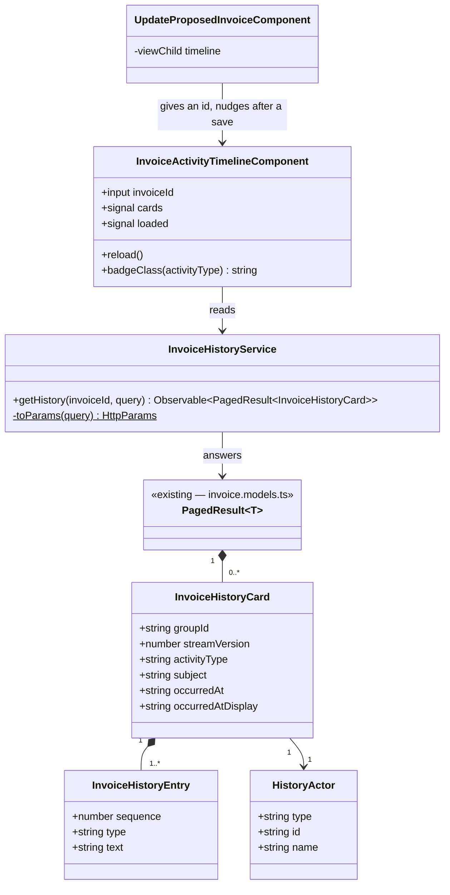

## Changelog

| Version | Date | Summary | Plan |
|---------|------|---------|------|
| v2 | 2026-10-05 | **The timeline renders.** v1 shipped the client and left the screen for a later version; this is that version, and it changes no requirement v1 wrote — it adds requirements 13–20, which are v1's *Out of Scope* list promoted verbatim, because they were already settled by the backend's rules and only ever needed somewhere to be built. `InvoiceActivityTimelineComponent` is its **own component rather than another section of the Update Invoice page**: that page's stylesheet already sits at the 6 kB per-component budget and its class at 750 lines, and a component that takes an id is reusable from the invoice list's rows where a section of another page is not. Two things are decided here that v1 did not have to: the card header **does not repeat the actor**, because every sentence that has one already ends *"… by {name}."* and a header name would print it twice on every card (**FR 17**); and a **saved correction re-reads the timeline** (**FR 20**), which is a re-read and not an optimistic insert — a card this screen composed would be the second record that a derived history exists to prevent (**BR-01**). | [2026-10-05T2015-08-invoice-activity-timeline-render](../../plans/rent-agreements/2026-10-05T2015-08-invoice-activity-timeline-render.md) |
| v1 | 2026-10-05 | **Initial spec: the client half of the invoice activity timeline — `InvoiceHistoryService` and the wire types it answers.** Backend `12-invoice-history.md` v4 derives a per-invoice audit timeline by folding the invoice's Marten event stream on every request and answers `GET /invoices/{id}/history` with a page of **cards**, each carrying a badge, a timestamp, an actor and one or more **finished plain-English sentences** composed server-side (its **D2**). That decision is what shapes this module: there is no template to assemble, no value to format and no wording to own, so the client is a typed read and nothing more. What it must get right is everything the server has *already decided* and a client can casually undo — the order (**BR-15**), the time zone (**BR-17**), the unescaped prose (**BR-09**), and the difference between an empty timeline and a missing invoice (**BR-27**/**BR-33**). This version ships the service and the models; the on-screen timeline is named in *Out of Scope* with the rules that will bind it. | [2026-10-05T1830-08-invoice-activity-timeline-ui](../../plans/rent-agreements/2026-10-05T1830-08-invoice-activity-timeline-ui.md) |

## Overview

`InvoiceHistoryService` (`src/app/invoices/invoice-history.service.ts`) and the wire types in
`invoice-history.models.ts` are the client of backend `12-invoice-history.md` — the audit timeline of
everything that has ever happened to one invoice, newest first.

**The server writes the sentences, so this module renders nothing and decides nothing.** Backend
**D2** settled that the endpoint returns finished text — *"Pet Deposit item of $130.00 added to the
invoice by Kount Testing."* — rather than a template id and a bag of values, so that one wording
serves the owner portal, the tenant portal and any future export, and so that the formatting rules
(`$1,450.00`, `Sep 24, 2026`, the **property's** time zone) stay in the one place that knows the
invoice's time zone. The cost of that trade falls here as a discipline rather than as work: every
figure on a card is already final, and the client's job is to not improve any of it.

**It is a read over a derived resource.** Nothing behind the endpoint is stored — the timeline is
folded out of `mt_events` per request (**BR-01**) — which means there is no cache to invalidate, no
version to send and no write path this module participates in. It also means every invoice that has a
stream has a complete history today, with no backfill (**BR-02**).

It is a **sibling of `InvoicesService` rather than a method on it** for the same reason
`InvoiceDocumentService` is: that service is a set of typed reads over the invoice *projection* — the
invoice's current face — and this one reads the invoice's *past*, from a different table, through a
different handler, with a paging envelope of its own.

## Business Scope

A property manager corrects an invoice, a tenant disputes the amount a fortnight later, and the only
thing the portal can show is the invoice's current face — which is precisely the thing under dispute.
The Merlin monolith has answered that question for years from its `invoice_activity` table. An invoice
raised by Billing has had no answer at all: the facts were appended to the stream on every change and
never read back out — `InvoiceProjection`'s own remarks call the payment events *"inert history"*.

Backend `12` is the reader that was always implied, and as of its v4 it has been exercised against a
running service. This module is what lets this application ask it.

Three facts shape the client:

1. **The order is the server's and it is not a timestamp.** Cards come back sorted by `streamVersion`
   descending (**BR-15**), because two events appended in one transaction share an instant but have a
   strict version order. A client that re-sorts by `occurredAt` would shuffle exactly the pairs the
   version ordering exists to separate.
2. **The displayed time is already in the property's time zone** (**BR-17**), taken from
   `InvoiceRaised.PropertyTimeZone`. `occurredAtDisplay` is `Sep 29, 2026 at 2:15 PM` for a Florida
   property whichever desk the browser is on. Re-deriving it from `occurredAt` with Angular's
   `DatePipe` would render the *viewer's* zone instead, silently, and most often for a manager in a
   different state from the unit.
3. **The sentences are unescaped plain text** (**BR-09**). The monolith emits
   `
… <strong>$130.00</strong> …
`; Billing deliberately does not, and interpolates
   owner-supplied values verbatim — a line item somebody named `<b>Rent</b>` arrives with those
   characters in it. Rendered as text that reads back exactly as typed; rendered as markup it is
   stored XSS with an owner-controlled payload.

Success: `getHistory(invoiceId)` answers the same two cards the backend's worked example describes,
in the backend's order, with the backend's wording, and an invoice nobody has touched answers an
empty page rather than an error.

## Functional Requirements

1. The system shall read one page of an invoice's timeline with
   `GET /api/v1/invoices/{id}/history`, answering the server's `PagedResult<InvoiceHistoryCard>`
   **unchanged** — no re-shaping, no re-ordering, no renaming.
2. The system shall send **no paging parameters at all** when the caller names none, taking the
   endpoint's defaults of page `1` and page size `50`. That default is generous on purpose: a typical
   invoice has fewer than twenty cards, so the first page is the whole history and this application
   never pages.
3. The system shall send `page` and `pageSize` **only when given**, omitting any member that is absent
   or blank — the same discipline as `InvoicesService.toParams`, and for the same reason: `pageSize=`
   is not the absence of a page size, it is an invalid one, and the endpoint answers `400` to it.
4. The system shall **not re-sort, re-group or re-number** what it receives. Cards are ordered by
   `streamVersion` descending (**BR-15**) and entries by `sequence` within a card (**BR-11**); both
   orders are the server's, and neither is client-selectable.
5. The system shall send **no scope of its own**. The organization, the property owner and the acting
   user ride the headers `scopeHeadersInterceptor` already attaches, or the bearer on the dev and qa
   builds — this endpoint reads none of them, and a parameter claiming otherwise would be a second
   answer to a question the request already answers.
6. The system shall type `activityType`, `entries[].type` and `actor.type` as **PascalCase enum
   names** — `InvoiceEdited`, `ItemAdded`, `PropertyOwner` — and not as the `snake_case` every other
   enum in this application arrives as. They are mapped to `string` before serialization
   (`card.ActivityType.ToString()`), so `JsonStringEnumConverter(SnakeCaseLower)` never sees them.
7. The system shall model `actor.id` and `actor.name` as **nullable**, and shall put nothing in their
   place. A `System` actor has no id; a name Identity could not resolve has no name (**BR-21**,
   **BR-31**), and in that case the sentence the server sent has **already** dropped its trailing
   `by …` clause — so a client that supplied a placeholder would be contradicting the text beside it.
8. The system shall read `totalCount`, `totalPages`, `hasNextPage` and `hasPreviousPage` from the
   response rather than recompute them, matching the rule the existing `PagedResult<T>` carries: the
   endpoint caps `pageSize`, so client arithmetic can disagree with the page actually served.
9. The system shall treat `200 OK` with `items: []` as **"nothing has happened to this invoice yet"**
   and not as a failure. A raise renders no card (**BR-04**), so a freshly raised invoice has an empty
   timeline by design (**BR-33**).
10. The system shall distinguish that empty page from **`404 invoice.not_found`**, which means no
    stream carries that id (**BR-27**). The two are reported differently or the screen says *"no
    history"* for an invoice that does not exist.
11. The system shall let a **deleted or voided** invoice's history be read in full, ending with the
    card that records the deletion (**BR-27**) — the same rule `GET /invoices/{id}` follows, and the
    reason the timeline is not gated on the Update Invoice page's `isCorrectable`.
12. The system shall report a failure through the **ordinary RFC 9457 `detail` reading** already used
    by every JSON screen. Unlike the download (spec [`07`](07-invoice-download-ui.md) requirement 10)
    this response is JSON, so the error body is JSON too and no blob-unwrapping applies.

### Rendering (v2)

13. The system shall present the timeline on the Update Invoice page for **every loaded invoice**,
    including one that cannot be corrected and one that is deleted or voided — a deleted invoice
    answers its whole history, ending with the card that records the deletion (**BR-27**). Gating it
    on `isCorrectable` would hide an audit trail from exactly the invoices whose past is most often
    asked about.
14. The system shall display **`occurredAtDisplay` as sent**, and shall not re-derive a time from
    `occurredAt` through a `DatePipe`. The sent string is in the **property's** time zone (**BR-17**);
    a pipe would render the viewer's — usually a manager at a desk in a different state from the unit,
    and wrong without ever looking wrong.
15. The system shall render `entries[].text` **through interpolation and never through `[innerHTML]`**.
    The server composes plain text and interpolates owner-typed values verbatim with no escaping
    (**BR-09**), so a line item named `<b>Rent</b>` arrives with those characters in it — text that
    reads back as typed, or markup that is stored XSS with an owner-controlled payload.
16. The system shall render cards and entries **in the order received**, keyed on `groupId` and
    `sequence`, re-sorting neither (**BR-11**, **BR-14**, **BR-15**).
17. The system shall **not repeat the actor in the card header**. Every sentence that has an actor
    already ends *"… by {name}."*, so a header name would print it twice on every card; where the
    server could not resolve a name it has already dropped that clause and there would be nothing to
    show. No placeholder stands in for a `null` name (FR 7).
18. The system shall give every badge a style through a **default branch**, so the five specified and
    unproduced activity types (**D7**, **BR-25**) render when they begin to arrive rather than
    appearing unstyled.
19. The system shall say *"nothing has happened to this invoice yet"* for an empty page — and only
    once a read has **completed**, so the message cannot appear during the first request or after a
    failed one — while reporting a `404` in its own error banner (FR 9, FR 10). It shall also state
    plainly how many activities it is **not** showing when `hasNextPage` is set, rather than silently
    truncating.
20. The system shall **re-read the timeline after a correction saves**. A correction appends an event
    and the timeline is derived from the events, so the new card exists the moment the server answers.
    It is a re-read: nothing is composed or inserted locally, because a card this screen wrote would be
    a second record of the change and a second record is what a derived history exists to prevent
    (**BR-01**).

## Constraints

- **The wording, the money format and the dates are not this application's to change.** `$130.00`,
  `September 29, 2026` inside a payment sentence and `Sep 24, 2026` inside a due-date sentence are
  three deliberate server-side choices (**BR-28**, **BR-29**, backend **D9** — the monolith's two date
  formats are kept for launch parity). A client that normalised them would be reverting a decision,
  and translating this screen later means translating the server, not this module.
- **`occurredAt` exists for sorting and for machines, not for display.** It is ISO-8601 carrying the
  property's offset; `occurredAtDisplay` is what a person reads. Both are sent because they answer
  different questions, and requirement 4 plus the time-zone argument above is why only one of them is
  rendered.
- **Every enum member the backend declares can arrive, including ones nothing produces yet.**
  `LateFeeApplied`, `LateFeeRemoved`, `ReminderSent`, `DepositReturned` and `DepositApplied` are
  specified and unproduced — backend **D7** fixes their badges and sentences now precisely so the
  response shape does not change when the owning services start announcing them (**BR-25**). The
  models therefore list them, and any renderer needs a **default branch** rather than an exhaustive
  match.
- **The actor is a person on an owner-initiated change and `System` on a sweep.** Since backend
  **D4** an edit, void or delete carries the acting user, while the nightly overdue pass stamps
  `System` — *"a date passing is nobody's act"* — and so does a payment, because Finance reports what
  was paid and not who keyed it in. *"By the system"* on an overdue or payment card is the specified
  behaviour, not a gap to work around.
- **A name costs a hop and may simply not arrive.** The server resolves actor names by calling
  Identity per render with no cache, and a timeout, an error or an unknown user degrades to the
  unnamed sentence and still answers `200` (**BR-31**). So the same invoice can render named sentences
  on one read and unnamed ones on the next, with nothing wrong anywhere.
- **Requires backend `12-invoice-history.md` v4 or later.** Against v3 the endpoint behaves
  identically; against anything earlier the Identity lookup was addressing a doubled gateway path and
  every sentence silently lost its `by …` clause — a defect this client cannot detect, because an
  unnamed actor is a legitimate response.

## Contract

### API Endpoints consumed

| Method | Route | Used for | Notable responses |
|--------|-------|----------|-------------------|
| `GET` | `/api/v1/invoices/{id}/history` | one page of the invoice's activity timeline, newest first | `200` `PagedResult<InvoiceHistoryCardResponse>` — possibly with `items: []` (**BR-33**); `400` when `page < 1` or `pageSize` is outside `1..200` (**BR-24**); `404` `invoice.not_found` when no stream carries that id (**BR-27**) |

Query string: `page` (optional, `>= 1`, default `1`), `pageSize` (optional, `1..200`, default `50`).

### Input / Output models

`InvoiceHistoryQuery` — what `getHistory` accepts beside the id. Both members optional (FR 2, FR 3).

| Field | Type | Notes |
|-------|------|-------|
| `page` | `number?` | 1-based. Omitted from the request when absent |
| `pageSize` | `number?` | `1..200`. Omitted from the request when absent |

`InvoiceHistoryCard` — one appended event, one card (**BR-14**).

| Field | Type | Notes |
|-------|------|-------|
| `groupId` | `string` | The Marten event id. Stable across renders, so it is the `@for` track key |
| `streamVersion` | `number` | The descending sort key (**BR-15**). Unique within one timeline |
| `activityType` | `InvoiceHistoryActivityType` | The badge's meaning, PascalCase (FR 6) |
| `subject` | `string` | The badge's text, e.g. `Invoice Edited`. Rendered as sent, never derived from `activityType` |
| `occurredAt` | `string` | ISO-8601 with the **property's** offset. Not for display (see Constraints) |
| `occurredAtDisplay` | `string` | `Sep 29, 2026 at 2:15 PM`. This is what a person reads |
| `actor` | `HistoryActor` | Who acted |
| `entries` | `InvoiceHistoryEntry[]` | One per change inside the event. **Never empty** — an event producing no sentence produces no card (**BR-18**) |

`InvoiceHistoryEntry`

| Field | Type | Notes |
|-------|------|-------|
| `sequence` | `number` | 0-based position on the card, fixed by **BR-11**'s name → description → quantity → rate ordering |
| `type` | `InvoiceHistoryEntryType` | Which sentence template produced `text`, so a client can style or filter **without parsing prose** |
| `text` | `string` | The finished sentence, always ending in `.`. **Plain text, unescaped** (**BR-09**) |

`HistoryActor`

| Field | Type | Notes |
|-------|------|-------|
| `type` | `HistoryActorType` | `System` \| `PropertyOwner` \| `Tenant` |
| `id` | `string \| null` | `null` only for `System` |
| `name` | `string \| null` | `null` for `System` and for any actor Identity could not resolve (FR 7) |

`InvoiceHistoryActivityType` — `InvoiceEdited`, `PaymentReceived`, `PaymentReversed`, `MarkedOverdue`,
`InvoiceVoided`, `InvoiceDeleted`, `LateFeeApplied`, `LateFeeRemoved`, `ReminderSent`,
`DepositReturned`, `DepositApplied`. **No creation member** — a raise renders no card (**BR-04**),
matching the monolith, whose own `InvoiceActivityType` has none either.

`InvoiceHistoryEntryType` — `ItemAdded`, `ItemRemoved`, `RateUpdated`, `QuantityUpdated`,
`DescriptionUpdated`, `ItemRenamed`, `DueDateChanged`, `TenantSplitUpdated`, `PaymentReceived`,
`PaymentReversed`, `MarkedOverdue`, `InvoiceVoided`, `InvoiceDeleted`, `LateFeeApplied`,
`LateFeeRemoved`, `ReminderSent`, `DepositReturned`, `DepositApplied`.

The envelope is the existing `PagedResult<T>` from `invoice.models.ts`, reused rather than redeclared:
the backend returns `Innago.BuildingBlocks.Application.PagedResult<T>` here exactly as it does for
`GET /api/v1/invoices`, so a second copy of that interface could only ever drift from the first.

> **The paging field is `pageNumber`, not `page`.** Backend `12`'s sample response prints `"page": 1`,
> but `PagedResult<T>` is a record whose member is `PageNumber` and nothing renames it on the way out.
> The query *parameter* is `page`; the *response* field is `pageNumber`. Checked against
> `BuildingBlocks.Application/PagedResult.cs`, not inferred — and it is why FR 1 reuses the interface
> the invoice list already proved against a live response.

### Class Diagram

This module persists nothing and holds no state, so this spec carries no Data Model or Table Structure
section. Neither does the backend's — the timeline is derived, not stored (**BR-01**).

## Out of Scope

- **The timeline anywhere but the Update Invoice page.** `InvoiceActivityTimelineComponent` takes an
  id and nothing else, so the invoice list's rows are a template change and an input — but those rows
  are spec [`04-invoice-list-ui.md`](04-invoice-list-ui.md)'s, and widening them is that spec's
  version.
- **Paging controls.** `getHistory` takes `page` and `pageSize` because the endpoint does. Nothing
  calls it with either yet, and nothing should until an invoice with more than 50 cards exists to
  justify the control — the default page is the whole history for every invoice this application has
  seen.
- **Filtering a timeline by activity type.** The endpoint offers no filter, `entries[].type` exists so
  a client can style or filter *locally*, and a filter that hid cards from an audit trail is a feature
  that needs deciding rather than inferring.
- **Anything that would make the history disagree with the invoice.** No local cache, no optimistic
  card appended after a correction, no merge with the `payments` array on `GET /invoices/{id}`. The
  timeline's whole claim is that it is the invoice's own events; a client-side addition to it would be
  a second record, which is the failure mode backend **BR-01** exists to prevent. FR 20's re-read
  after a save is the sanctioned alternative: ask the server again rather than guess what it will say.
