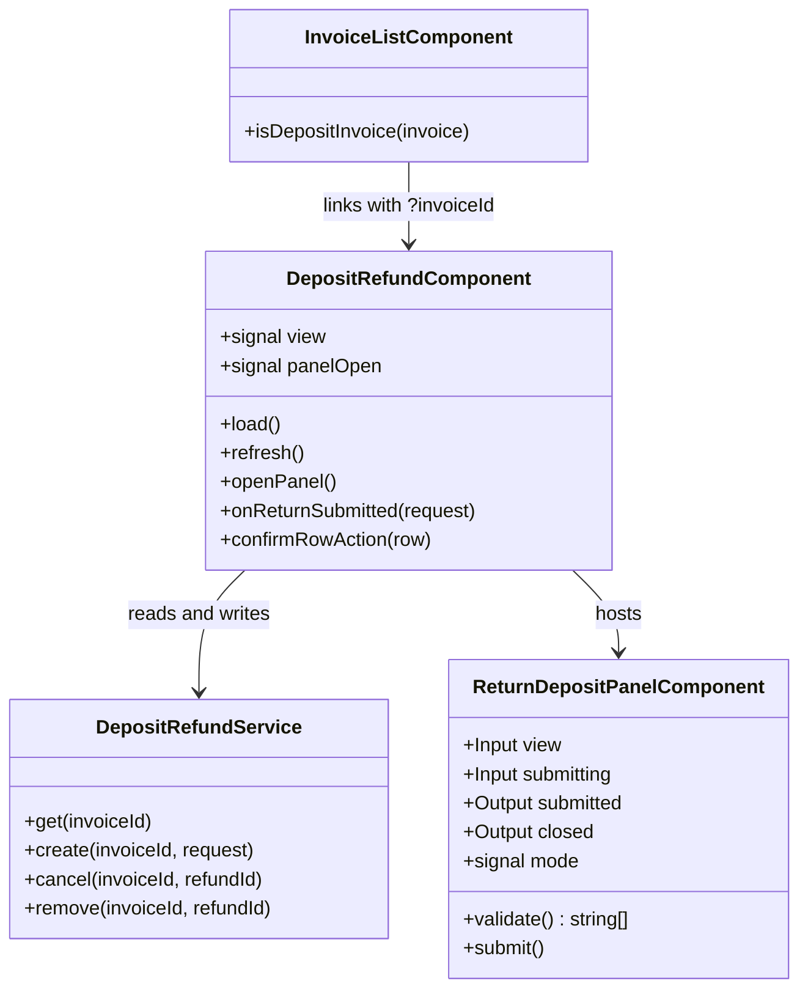

## Changelog

| Version | Date | Summary | Plan |
|---------|------|---------|------|
| v1 | 2026-10-07 | **Initial spec: the Deposit Refund page — read a deposit invoice's refund view, return the deposit offline or online, and cancel or remove a return.** The client half of backend `15-deposit-refund.md` **v2**, which made Billing the front door for every refund of a deposit invoice it raised: `GET /invoices/{id}/deposit-refund` for the flags, totals, per-tenant rows and *Funds Returned* rows (BR-01 – BR-15), and `POST …/deposit-refunds`, `POST …/deposit-refunds/{refundId}/cancel` and `DELETE …/deposit-refunds/{refundId}` for the writes (BR-16 – BR-26), all of which Billing checks before forwarding to Finance. The screen mirrors the production owner app's *Refund Deposit* → *Return Deposit* → *Return Offline* / *Return Online* flow and its *Funds Returned* block, adapted to this harness: **the owner's bank account is typed, not picked**, because the bank list is merlin's (`GET Home/DropDown/GetPropertyOwnerBankDetails`) and this application cannot reach it. Reached from a new **Deposit Refund** item on the Invoices list's row menu (spec [`04-invoice-list-ui.md`](04-invoice-list-ui.md) v10, FR 27), from the sidebar, and by `?invoiceId=`. Numbered 09 because 07 and 08 are taken by work in flight on another branch. | [2026-10-07T1800-09-deposit-refund-ui](../../plans/rent-agreements/2026-10-07T1800-09-deposit-refund-ui.md) |

## Overview

`DepositRefundComponent` (`src/app/invoices/deposit-refund.component.ts`, route
`/invoices/deposit-refund`) is the page; `ReturnDepositPanelComponent`
(`src/app/invoices/return-deposit-panel.component.ts`) is the *Return Deposit* side panel it opens;
`DepositRefundService` (`src/app/invoices/deposit-refund.service.ts`) is the HTTP client for the four
endpoints of backend spec `15-deposit-refund.md` v2.

**Everything money-shaped comes from the server, and the screen renders it rather than recomputing
it.** Whether a refund is allowed, what was paid, what has been returned and what is still held are
all derived by Billing on every request from the invoice projection and a live Finance read (BR-06,
D2). The only arithmetic this client does is the panel's running totals — the owner's own entries
measured against the `remaining` the server reported — and even that is re-checked by the server
(BR-19) before anything reaches Finance.

**A `202` means queued, not refunded** (BR-24). The return appears under *Funds Returned* once
Finance's consumer has run, so the page refreshes after a successful submission and says plainly that
the row may take a moment to appear.

## Business Scope

An owner holds a tenant's security deposit and, at move-out, hands it back — in cash, by check or
money order (recorded *offline*), or through Innago from the owner's bank (*online*). Until backend
`15` v2 none of that could happen for an invoice Billing raised: the owner app read the refund view
from merlin, keyed by merlin's numeric id, and a Billing invoice has none. This page is the harness the
team uses to drive the new Billing endpoints end to end before the owner app is pointed at them.

Success: open a fully paid deposit invoice, see what was paid and what is held, return part of it by
check, see the return listed under *Funds Returned* with its check number, remove it again; and when a
rule is broken — too much returned, a missing check number — read the same sentence the owner app
shows, before a request is sent.

## Functional Requirements

1. The system shall offer the page at `/invoices/deposit-refund`, **lazy-loaded**, taking the invoice
   id typed into a lookup box or from `?invoiceId=`, refusing an empty or malformed id inline without
   calling the API, and loading the view with `GET /api/v1/invoices/{id}/deposit-refund`.
2. The system shall render a failed load's RFC 9457 `detail` verbatim — `404 invoice.not_found`,
   `502 deposit_refund.payment_service_unavailable` — falling back to the status line, and shall never
   render empty figures in its place (BR-10).
3. The system shall show the invoice number and the four flags the server derives
   (`isDepositInvoice`, `isFullyPaid`, `isDepositRefundStarted`, `isDepositFullyRefunded`). For an
   invoice that is **not a deposit invoice** it shall say so and show nothing else (BR-12). For a
   deposit invoice that is **not fully paid** it shall say the deposit cannot be returned yet.
4. The system shall show a **Refund Deposit** action when `isDepositInvoice && isFullyPaid`, and shall
   render it **disabled**, with the tooltip *"Deposit has already been refunded."*, when
   `isDepositFullyRefunded`. A disabled action shall not open the panel by any route.
5. **Refund Deposit** shall open the *Return Deposit* side panel with a choice of **Return Offline** and
   **Return Online**. Switching between them shall keep what was typed into each.
6. **Offline** shall show one row per `tenants[]` entry: payer name, *Deposit Held* (`held`), a
   *Method* select (Check · Cash · Money Order), a *Check/MO No.* box, *Amount to Return* and *Deposit
   Interest*. Choosing Cash shall **clear and disable** the number box.
7. The panel shall show running totals: *Total Held* = `totals.depositAmount`; *Deposit Interest* = Σ
   interest entered; *Amount to Return* = Σ (amount + interest) entered; *Remaining Deposit* =
   `totals.remaining` − Σ amount entered. Interest never reduces *Remaining Deposit* (BR-06).
8. Before sending, the system shall refuse — listing every reason, and sending nothing — when, among
   the entries that would be sent (mirroring BR-17 and BR-19):
   - an amount or interest is negative, not a number, or has more than two decimals;
   - no amount is greater than 0;
   - Σ amount exceeds `totals.remaining` — with the server's own sentence, *"Amount to return should be
     less than remaining amount"*;
   - a Check or Money Order row carries no number, or one longer than 25 characters.
   The list shall update as the owner corrects the entries, and offending inputs shall be marked.
8a. The system shall refuse a row with **interest but no amount**, naming the payer. *A client-only
   rule, and deliberately so:* BR-18 drops a zero-amount row before Finance is called, so the server
   would accept the request and **silently discard the interest the owner typed**.
9. The offline request shall carry only rows whose amount is greater than 0 (BR-18); a Cash row shall
   carry **no `checkNumber` key**; the number shall be trimmed; and the request shall carry no
   `ownerBank` or `backupAddress`.
10. **Online** shall take **exactly one** tenant, chosen from `tenants[]` (preselected when there is only
    one), an amount greater than 0 and within `remaining`, interest ≥ 0, the owner's bank account and
    an optional backup mailing address. Because this application cannot reach the owner's bank list,
    the bank account shall be **typed**, field by field, each labelled with where its value comes from:
    `bankId` (a GUID), `bankName`, `accountHolder`, `accountTypeId` (a whole number), and the
    **already-encrypted** `accountNumber`, `routingNumber` and `fundingSource`, pasted verbatim. The
    client shall require what BR-17 requires (`bankId`, `bankName`, `accountNumber`, `routingNumber`,
    `fundingSource`) plus a whole-number `accountTypeId`, which the wire types as `int`. When the backup
    address is included it shall require `line1`, a `city` of letters and spaces, `state` and a
    5-digit `zip`; `line2` is optional and omitted when blank. The online request shall carry no
    `method` or `checkNumber`.
11. The system shall send `POST /api/v1/invoices/{id}/deposit-refunds` **once** per submission, keep the
    panel open until the server answers, and ignore a second submission while one is in flight — the
    call reaches Finance at most once (BR-23) and a double click must not ask twice.
12. On `202` the system shall close the panel, show *"Offline deposit return has been recorded
    successfully."* or *"Online deposit return has been recorded successfully."* together with the fact
    that accepted means queued at Finance, and **re-read the view**.
13. On `400` or `422` — and on `502 deposit_refund.payment_service_unavailable`, which means nothing was
    sent — the system shall render the Problem Details `detail` verbatim (for
    `rejected_by_payment_service` that is Finance's own message) with its code, above the panel, and
    keep every typed value.
14. On `502 deposit_refund.submission_unconfirmed` the system shall **close the panel, re-read the view
    and show the server's warning** (*"…Check Funds Returned before trying again."*). The return may
    already be queued, so the screen shall not leave a one-click resubmission waiting behind the error.
15. The system shall render **Funds Returned** for a deposit invoice: one row per `fundsReturned[]`
    entry in the server's order (newest first) with *Payer*, *Received On*, *Returned On*, *Status*
    (Initiated · Processing · Refunded · Issued), *Method*, *Check/MO No.* (the number; *N/A* for Cash;
    *—* otherwise) and *Amount Returned*; and an explicit empty state when nothing has been returned.
    Dates show the server's own date part with the full value on hover.
16. Each row shall offer an actions menu holding **Cancel** when `canCancel` and **Remove** when
    `canRemove`, and no menu when neither. Each action shall ask for confirmation before calling
    `POST …/deposit-refunds/{refundId}/cancel` or `DELETE …/deposit-refunds/{refundId}`. On `204` it
    shall confirm what happened and re-read the view; on failure it shall render the `detail` as an
    error (`422 cannot_cancel` / `cannot_remove`, `502 cancel_failed`), and on
    `submission_unconfirmed` shall also re-read the view.
17. Below the table the system shall show *Total Paid*, *Total Returned*, *Deposit Interest*, *Amount
    Applied To Open Invoices* (`totalApplied`) and *Remaining Deposit Liability* (`remaining`), exactly
    as served.
18. Names shall be read from the server — `payerName` on a *Funds Returned* row, `name` on a tenant row
    (BR-09) — and only when both are `null` fall back to the stand-in person this application derives
    from the tenant id (`placeholderTenantIdentity`), so a tenant reads as the same person here as on
    the Invoices list and ADD TENANTS. The tenant id shall be available on hover.
19. A change of Test scope (`01-rent-agreement-edit-ui.md` requirement 15g) shall re-read the view,
    and shall not rebuild an open panel's entries.

## Constraints

- **Requires backend `15-deposit-refund.md` v2.** Against v1 the three write endpoints do not exist and
  answer `404`/`405`, which this screen renders as an ordinary failure.
- **The Problem Details code is `errorCode` on the wire.** `Innago.BuildingBlocks.Api` 9.5.2 writes
  `Error.Code` to an `errorCode` extension member, and the Billing API tests assert on that name; the
  backend handoff note calls it `code`. The client reads `errorCode` and falls back to `code`, so either
  spelling works and neither is guessed at.
- **Accepted is not refunded.** Finance queues the return and a consumer creates it later (BR-24), so
  the re-read straight after a `202` may not list it yet. Until Finance ships **F1** (stop
  `Convert.ToInt64` on Billing's `INV-…` number) a Return on a Billing invoice is accepted and then
  fails inside Finance — outside anything this screen can observe.
- **Bank fields pass through.** The three encrypted values are pasted, sent once and forgotten: they are
  not remembered in `localStorage`, not logged, and not echoed into any message (backend BR-22).
- **No retry, anywhere.** A refused or unconfirmed write is never re-sent by this client; a person
  deciding to press the button again, after checking *Funds Returned*, is the retry policy.
- **The scope is the request's, not the page's.** Every call rides `scopeHeadersInterceptor`; another
  owner's invoice answers `404 invoice.not_found`, identical to a missing one (BR-11).
- **Per-component style budget (6 kB warning).** The page and the panel each keep their own styles under
  it, reusing the global `.banner`, `.panel-overlay`, `.close-btn` and `.link-btn`.

## Contract

### API Endpoints consumed

| Method | Route | Used for | Notable responses |
|--------|-------|----------|-------------------|
| `GET` | `/api/v1/invoices/{id}/deposit-refund` | the refund view | `200` `DepositRefundResponse`; `400` `deposit_refund.get_validation_failed`; `404` `invoice.not_found`; `502` `deposit_refund.payment_service_unavailable` |
| `POST` | `/api/v1/invoices/{id}/deposit-refunds` | return the deposit, offline or online | `202` `{ invoiceId, status: "accepted" }`; `400` `deposit_refund.create_validation_failed`; `404` `invoice.not_found`; `422` `not_a_deposit_invoice` · `deposit_not_fully_paid` · `already_fully_refunded` · `exceeds_remaining_deposit` · `tenant_has_not_paid` · `rejected_by_payment_service`; `502` `payment_service_unavailable` · `submission_unconfirmed` |
| `POST` | `/api/v1/invoices/{id}/deposit-refunds/{refundId}/cancel` | cancel an online return | `204`; `404` `invoice.not_found` · `deposit_refund.refund_not_found`; `422` `deposit_refund.cannot_cancel`; `502` `payment_service_unavailable` · `cancel_failed` |
| `DELETE` | `/api/v1/invoices/{id}/deposit-refunds/{refundId}` | remove an offline return | `204`; `404` `invoice.not_found` · `deposit_refund.refund_not_found`; `422` `deposit_refund.cannot_remove`; `502` `payment_service_unavailable` · `submission_unconfirmed` |

Every error body is `application/problem+json` with `detail` (rendered verbatim) and the
`errorCode` extension (rendered beside it).

### Input / Output models

JSON is camelCase; enums are snake_case strings.

`DepositRefundResponse`: `invoiceId`, `invoiceNumber`, `isDepositInvoice`, `isFullyPaid`,
`canRefundDeposit`, `isDepositRefundStarted`, `isDepositFullyRefunded`, `totals`, `tenants[]`,
`fundsReturned[]`.

| Type | Fields |
|------|--------|
| `totals` | `depositAmount`, `totalPaid`, `totalReturned`, `depositInterest`, `totalApplied`, `remaining` |
| `tenants[]` | `tenantId`, `name \| null`, `paid`, `returned`, `interestReturned`, `held` |
| `fundsReturned[]` | `refundId`, `tenantId`, `payerName \| null`, `receivedOn \| null`, `returnedOn`, `status` (`initiated` · `processing` · `refunded` · `issued`), `method` (`unknown` · `credit_card` · `check` · `ach` · `cash` · `money_order` · `innago_paper_check` · `livble`), `checkNumber \| null`, `amountReturned`, `canCancel`, `canRemove` |

`CreateDepositRefundRequest`:

| Field | Offline | Online |
|-------|---------|--------|
| `mode` | `"offline"` | `"online"` |
| `returns[]` | one per tenant with amount > 0: `tenantId`, `method` (`cash` · `check` · `money_order`), `checkNumber` (check and money order only, 1–25), `amount`, `interest` | exactly one: `tenantId`, `amount`, `interest` |
| `ownerBank` | absent | `bankId`, `bankName`, `accountHolder`, `accountTypeId`, `accountNumber`, `routingNumber`, `fundingSource` |
| `backupAddress` | absent | optional: `line1`, `line2?`, `city`, `state`, `zip` |

### Class Diagram

The page persists nothing of its own, so this spec carries no Data Model or Table Structure section.

## Out of Scope

- **The owner's bank list.** It is merlin's; this harness types the account instead (FR 10).
- **The Update Invoice page.** A *Deposit Refund* link there, and surfacing backend BR-27's
  `422 deposit_refund.refund_in_progress` on a correction, both belong to that page's spec (`03`) and
  touch files another branch is changing; they are a follow-up, not part of this version.
- **Apply It** (US-8.9). `totalApplied` is always 0 on Billing invoices (BR-13); the figure is shown,
  the action is not offered.
- **Refund history cards and the PDF's refund block** — backend specs `12` v6 and `13` v11, and the
  invoice-history / invoice-download screens being built separately.
- **The `return.deposit.online` feature flag.** The owner app hides *Return Online* behind it; this
  harness always offers it.
- **Playwright scenarios.** Unit specs cover the screen; `docs/ui-automation-test-matrix.md` is not
  extended by this version.
